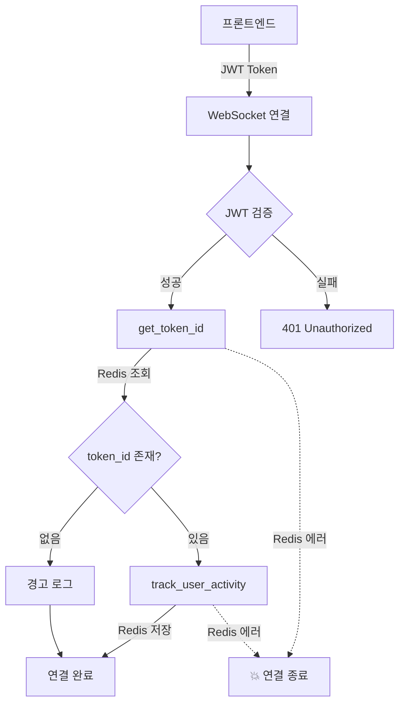

# 🔴 긴급 문제 분석 보고서: Smart Session 인증 실패

**작성일**: 2026-01-08 23:09 KST
**심각도**: CRITICAL
**영향**: 모든 WebSocket 연결 실패, 타이머 기능 완전 마비

---

## 📊 현재 상황

### 증상
1. **WebSocket 연결 즉시 종료** (1006 Abnormal Closure)
2. **타이머 API 500 에러** (CORS 헤더 없음)
3. **"연결 에러" 무한 반복**

### 서버 로그 (핵심 에러)
```python
redis.exceptions.ConnectionError: Error 111 connecting to localhost:6379. Connection refused.

File "/volume1/web/focusmate-backend/app/api/v1/endpoints/websocket.py", line 93
    token_id = await get_token_id(current_user.id)
               ^^^^^^^^^^^^^^^^^^^^^^^^^^^^^^^^^^^
File "/volume1/web/focusmate-backend/app/infrastructure/redis/session_helpers.py", line 21
    return await redis.get(redis_key)
           ^^^^^^^^^^^^^^^^^^^^^^^^^^
```

---

## 🎯 근본 원인 분석

### 1. Redis 연결 실패 (주범)

**문제**:
- Redis 서버는 실행 중 (PID 9710, 포트 6379)
- 하지만 백엔드가 Redis에 연결하지 못함

**원인 추정**:
1. **환경 변수 불일치**
   ```bash
   # 백엔드가 찾는 주소
   REDIS_URL=redis://localhost:6379

   # 실제 Redis 주소 (추정)
   redis://127.0.0.1:6379
   또는
   redis://192.168.45.58:6379
   ```

2. **Redis 클라이언트 초기화 실패**
   - `get_redis()` 함수가 잘못된 설정으로 연결 시도
   - Connection pool 생성 실패

3. **네트워크 격리**
   - Docker 네트워크 문제 (백엔드가 Docker라면)
   - 방화벽 또는 포트 바인딩 문제

### 2. Smart Session 로직의 치명적 결함

**설계 의도**:
```
WebSocket 연결 → token_id 조회 (Redis) → 활동 추적 → 세션 연장
```

**실제 동작**:
```
WebSocket 연결 → token_id 조회 실패 (Redis 에러) → 연결 종료 💥
```

**문제점**:
1. **필수 의존성 처리**
   - `get_token_id()`가 실패하면 WebSocket 전체가 크래시
   - 예외 처리 없음 → 500 에러 → CORS 헤더 없음

2. **과도한 복잡성**
   ```python
   # WebSocket 연결 시 필요한 단계
   1. JWT 토큰 검증 ✅
   2. 사용자 인증 ✅
   3. Redis에서 token_id 조회 ❌ (실패 시 전체 중단)
   4. Redis에 활동 추적 ❌ (실패 시 전체 중단)
   5. 방 참가자 등록 ✅
   6. WebSocket 연결 유지 ✅
   ```

3. **단일 실패 지점 (Single Point of Failure)**
   - Redis 장애 = 전체 시스템 마비
   - 세션 관리가 핵심 기능을 방해

---

## 🔍 상세 기술 분석

### Smart Session 구조



### 현재 코드 (websocket.py:93-100)
```python
# 문제 코드
token_id = await get_token_id(current_user.id)  # ❌ 예외 처리 없음
if not token_id:
    logger.warning(f"No token_id found for user {current_user.id}")

if token_id:
    try:
        await track_user_activity(current_user.id, token_id, room_id)
    except Exception as e:
        logger.error(f"Failed to track activity: {e}")
```

**문제**:
- `get_token_id()`가 Redis 연결 에러 발생 시 예외를 던짐
- 예외가 catch되지 않아 WebSocket 연결 전체가 종료됨

### Redis 클라이언트 (추정)
```python
# app/infrastructure/redis/client.py
async def get_redis():
    # 문제: 연결 실패 시 예외 발생
    return await aioredis.from_url(
        settings.REDIS_URL,  # redis://localhost:6379
        encoding="utf-8",
        decode_responses=True
    )
```

---

## 💡 해결 방안

### 옵션 1: Smart Session 단순화 (권장 ⭐)

**목표**: Redis 장애 시에도 WebSocket 연결 유지

**수정 코드**:
```python
# websocket.py:93-105
try:
    token_id = await get_token_id(current_user.id)
    if token_id:
        await track_user_activity(current_user.id, token_id, room_id)
    else:
        logger.warning(f"No token_id found for user {current_user.id}")
except Exception as e:
    # Redis 에러 무시, 연결은 유지
    logger.warning(f"Session tracking failed (non-critical): {e}")
    token_id = None
```

**장점**:
- Redis 장애 시에도 서비스 정상 작동
- 최소한의 코드 변경
- 세션 관리는 선택적 기능으로 격하

**단점**:
- Redis 장애 시 세션 연장 불가
- 활동 추적 데이터 손실

### 옵션 2: Redis 연결 문제 해결

**진단 단계**:
```bash
# 1. Redis 연결 테스트
redis-cli -h localhost -p 6379 ping

# 2. 환경 변수 확인
cat /volume1/web/focusmate-backend/.env | grep REDIS

# 3. Python에서 직접 테스트
python3 -c "
import redis
r = redis.Redis(host='localhost', port=6379)
print(r.ping())
"
```

**수정 방법**:
1. `.env` 파일에서 `REDIS_URL` 확인 및 수정
2. Redis 클라이언트 초기화 로직 수정
3. Connection pool 설정 추가

### 옵션 3: Smart Session 완전 제거

**목표**: 시스템 단순화, 안정성 우선

**제거 대상**:
1. `get_token_id()` 호출 (websocket.py:93)
2. `track_user_activity()` 호출 (websocket.py:98-102)
3. `session_helpers.py` 전체 (선택)

**대안**:
- JWT 토큰 만료 시간 연장 (15분 → 1시간)
- Refresh Token으로만 세션 관리
- WebSocket 연결 = 활동으로 간주 (별도 추적 불필요)

**장점**:
- 시스템 복잡도 대폭 감소
- Redis 의존성 제거
- 장애 지점 제거

**단점**:
- 세밀한 활동 추적 불가
- 디바이스별 세션 관리 불가

---

## 📋 즉시 조치 사항

### 1단계: 긴급 패치 (5분)

```python
# backend/app/api/v1/endpoints/websocket.py:90-105
# 기존 코드 전체를 다음으로 교체

# Get token_id for activity tracking (optional)
token_id = None
try:
    from app.infrastructure.redis.session_helpers import get_token_id, track_user_activity
    token_id = await get_token_id(current_user.id)

    if token_id:
        await track_user_activity(current_user.id, token_id, room_id)
        logger.debug(f"[Room WS] Activity tracked for user {current_user.id}")
except Exception as e:
    # Redis 에러는 무시 (세션 추적은 선택적 기능)
    logger.warning(f"[Room WS] Session tracking failed (non-critical): {e}")
```

**배포**:
```bash
# 로컬에서 수정 후
git add backend/app/api/v1/endpoints/websocket.py
git commit -m "fix: Make session tracking optional in WebSocket"
git push origin main

# NAS에서 (자동 배포 대기 또는 수동)
cd /volume1/web/focusmate-backend
git pull
kill $(cat app.pid)
bash start-nas.sh
```

### 2단계: Redis 연결 확인 (10분)

```bash
# SSH 터미널에서
cd /volume1/web/focusmate-backend

# 환경 변수 확인
cat .env | grep REDIS

# 없으면 추가
echo "REDIS_URL=redis://localhost:6379" >> .env

# Redis 연결 테스트
redis-cli ping  # PONG 응답 확인

# Python 테스트
python3 << 'EOF'
import asyncio
import redis.asyncio as aioredis

async def test():
    try:
        r = await aioredis.from_url("redis://localhost:6379")
        result = await r.ping()
        print(f"✅ Redis 연결 성공: {result}")
    except Exception as e:
        print(f"❌ Redis 연결 실패: {e}")

asyncio.run(test())
EOF
```

### 3단계: 검증 (5분)

1. 브라우저 강력 새로고침 (Cmd+Shift+R)
2. 방 입장 테스트
3. WebSocket 연결 확인 (개발자 도구)
4. 타이머 시작/정지 테스트

---

## 🎯 장기 개선 방안

### 1. 세션 관리 재설계

**현재 문제**:
- Redis 의존성 과다
- 복잡한 token_id 매핑
- 활동 추적의 불명확한 목적

**개선안**:
```python
# 단순화된 세션 관리
class SessionManager:
    async def track_connection(self, user_id: str, room_id: str):
        """WebSocket 연결만으로 활동 추적"""
        # Redis 없이 DB만 사용
        await db.execute(
            "UPDATE users SET last_seen = NOW() WHERE id = :user_id",
            {"user_id": user_id}
        )
```

### 2. 장애 격리 (Circuit Breaker)

```python
class RedisCircuitBreaker:
    def __init__(self):
        self.failure_count = 0
        self.is_open = False

    async def call(self, func):
        if self.is_open:
            raise CircuitOpenError("Redis circuit is open")

        try:
            result = await func()
            self.failure_count = 0
            return result
        except Exception as e:
            self.failure_count += 1
            if self.failure_count > 3:
                self.is_open = True
            raise
```

### 3. 모니터링 추가

```python
# 세션 추적 성공률 모니터링
@app.middleware("http")
async def session_tracking_metrics(request, call_next):
    try:
        response = await call_next(request)
        metrics.increment("session.tracking.success")
    except RedisError:
        metrics.increment("session.tracking.failure")
        # 계속 진행
    return response
```

---

## ✅ 권장 조치 순서

1. **즉시** (지금): 긴급 패치 적용 (try-except 추가)
2. **오늘**: Redis 연결 문제 해결
3. **이번 주**: Smart Session 단순화
4. **다음 주**: 모니터링 및 Circuit Breaker 추가

---

## 📞 결론

**핵심 문제**:
- Smart Session이 너무 복잡하고 Redis에 과도하게 의존
- 예외 처리 부족으로 단일 실패 지점 발생
- Redis 연결 실패 = 전체 시스템 마비

**해결 방향**:
1. **단기**: 예외 처리 추가 (세션 추적 실패 무시)
2. **중기**: Redis 연결 문제 해결
3. **장기**: 세션 관리 단순화 또는 제거

**예상 효과**:
- 긴급 패치 후 즉시 서비스 정상화
- Redis 장애 시에도 서비스 지속 가능
- 시스템 안정성 대폭 향상
