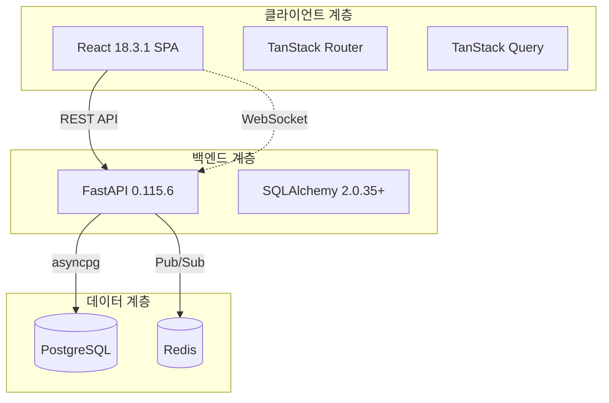
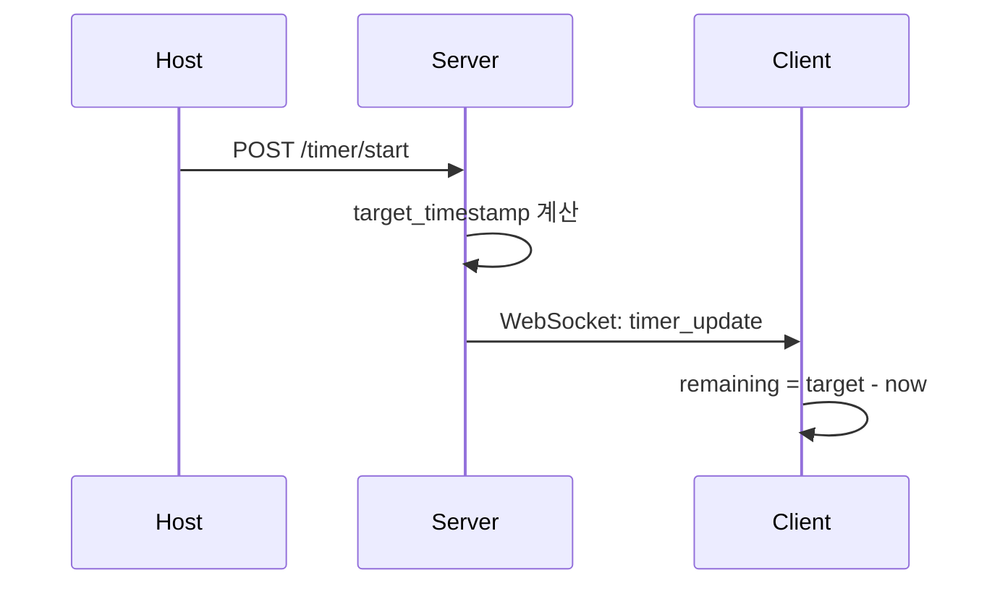
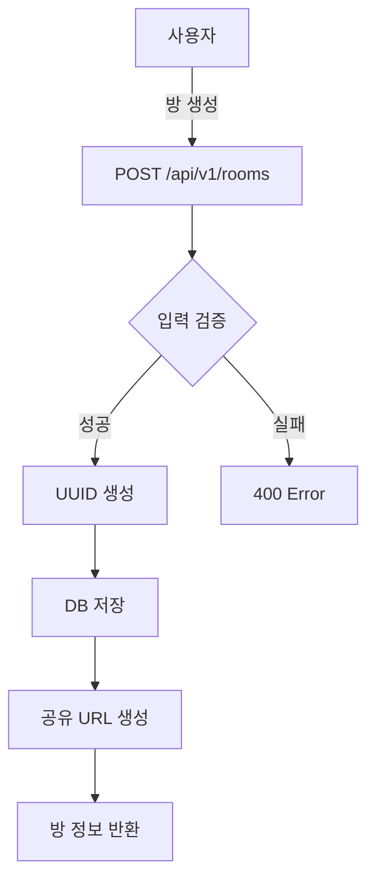
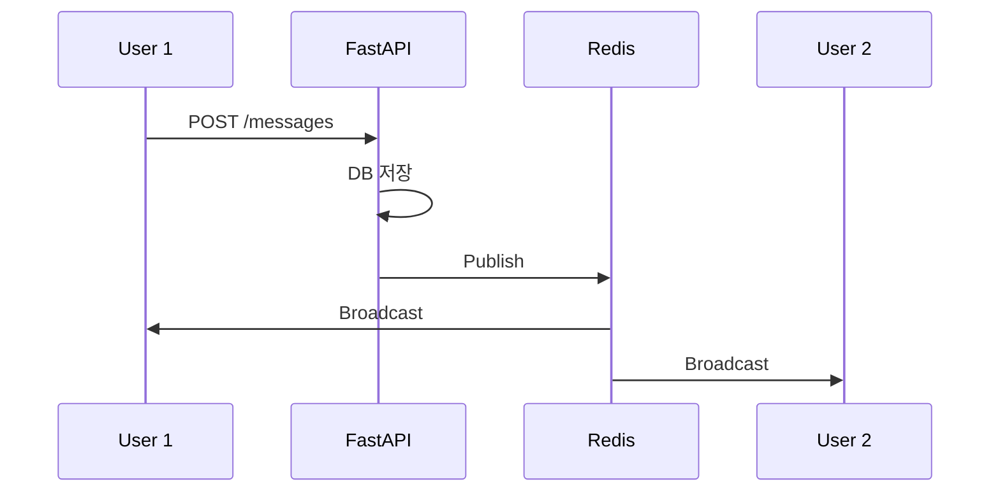
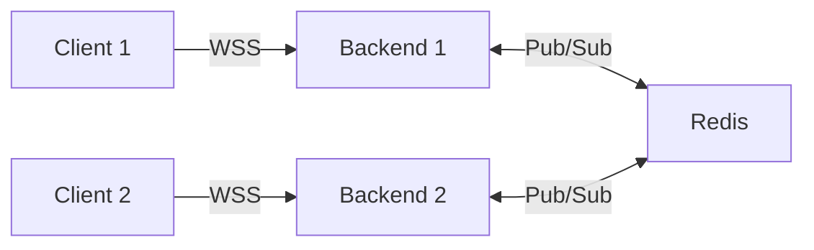
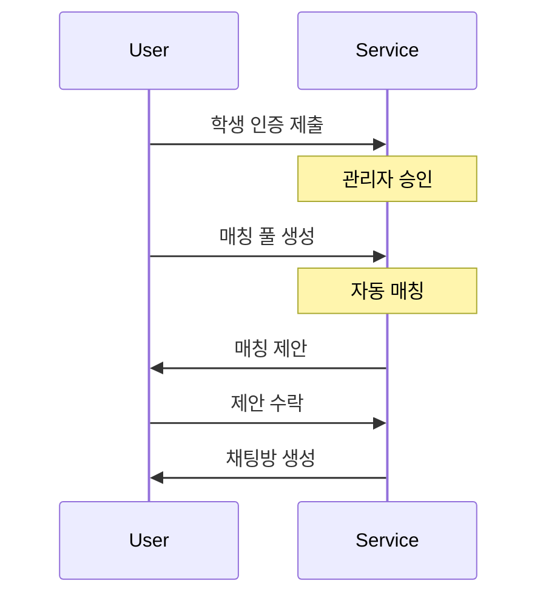

# Focus Mate 시스템 종합 발표 자료

**작성일**: 2025-12-19
**버전**: 1.0
**문서 유형**: 기술 발표 자료

---

## 📋 목차

1. [프로젝트 개요](#1-프로젝트-개요)
2. [시스템 아키텍처](#2-시스템-아키텍처)
3. [기술 스택](#3-기술-스택)
4. [핵심 기능 및 사용자 흐름](#4-핵심-기능-및-사용자-흐름)
5. [데이터베이스 설계](#5-데이터베이스-설계)
6. [실시간 통신 WebSocket](#6-실시간-통신-websocket)
7. [매칭 시스템](#7-매칭-시스템)
8. [랭킹 시스템](#8-랭킹-시스템)
9. [문제 해결 방식 및 알고리즘](#9-문제-해결-방식-및-알고리즘)
10. [보안 및 성능 최적화](#10-보안-및-성능-최적화)

---

## 1. 프로젝트 개요

### 1.1 프로젝트 정체성

**Focus Mate**는 단순한 웹사이트가 아닌 **고품질 생산성 애플리케이션(High-Fidelity Productivity Application)**입니다.

#### 핵심 가치
- **몰입감**: 페이지 로딩 없이 작업에 집중할 수 있는 환경
- **즉각적인 반응**: 모든 액션이 0.1초 이내 반응
- **신뢰성**: 네트워크 불안정 시에도 핵심 기능 유지

### 1.2 시스템 목적

원격 근무 환경에서 팀원들의 집중력과 생산성을 향상시키기 위한 **팀 기반 포모도로 타이머 협업 도구**

#### 주요 기능
- 🏠 **방 생성 및 관리**: 팀 단위 포모도로 세션 공간
- ⏱️ **실시간 타이머 동기화**: 서버 기반 SSOT
- 📊 **통계 및 분석**: 개인/팀 집중 시간 추적
- 🏆 **랭킹 시스템**: 팀 단위 경쟁 및 동기부여
- 💬 **매칭 시스템**: 과팅 스타일 그룹 매칭
- 💬 **통합 메시징**: Direct, Team, Matching 채팅

### 1.3 통계

| 항목 | 수량 |
|------|------|
| **데이터베이스 테이블** | 38개 |
| **API 엔드포인트** | 100+ |
| **프론트엔드 라우트** | 20+ |
| **WebSocket 채널** | 3종류 |
| **총 코드 라인** | 10,000+ |

---

## 2. 시스템 아키텍처

### 2.1 설계 철학

Focus Mate의 아키텍처는 3가지 핵심 철학을 기반으로 설계되었습니다.

#### 1. Zero-Latency Interaction
- **전략**: 순수 SPA 아키텍처 채택, SSR 배제
- **구현**: TanStack Router의 Preload 기능
- **목표**: 모든 UI 상호작용 100ms 이내 반응

#### 2. Client-First State
- **전략**: 백엔드는 순수 데이터 API
- **구현**: TanStack Query로 서버 데이터 동기화
- **목표**: 오프라인 환경에서도 앱 동작

#### 3. Type-Safety Across Boundaries
- **전략**: 코드로 계약 맺기
- **구현**: FastAPI OpenAPI → TypeScript 타입 자동 생성
- **목표**: 백엔드 변경이 컴파일 에러로 즉시 감지

### 2.2 전체 시스템 구조



### 2.3 계층별 아키텍처

#### 프론트엔드 구조
```
src/
├── routes/              # 파일 기반 라우팅
│   ├── __root.tsx      # 최상위 레이아웃
│   ├── index.tsx       # 메인 페이지
│   ├── rooms/
│   │   ├── $roomId.tsx # 동적 라우팅
│   │   └── index.tsx
│   └── _auth.tsx       # 인증 필요 라우트
├── components/
│   ├── ui/             # Radix UI 컴포넌트
│   └── features/       # 비즈니스 로직
├── hooks/
│   └── queries/        # TanStack Query 훅
└── api/
    └── generated/      # OpenAPI Codegen
```

#### 백엔드 구조
```
app/
├── api/v1/endpoints/   # Router Layer
├── services/           # Service Layer
├── repositories/       # Repository Layer
├── models/             # SQLAlchemy Models
└── schemas/            # Pydantic Schemas
```

---

## 3. 기술 스택

### 3.1 프론트엔드

#### 핵심 프레임워크
- **React 18.3.1**: Concurrent, Suspense
- **TypeScript 5.9.3**: Strict 모드
- **Vite 6.4.1**: 빠른 HMR

#### 라우팅 및 상태 관리
- **TanStack Router 1.141.0**: 타입 안전 라우팅
- **TanStack Query 5.90.12**: 서버 상태 관리

#### UI 라이브러리
- **Radix UI**: 접근성 우선
- **Tailwind CSS 4.1.18**: 유틸리티 CSS
- **Framer Motion 12.23.26**: 애니메이션
- **Recharts 2.15.4**: 차트

### 3.2 백엔드

#### 웹 프레임워크
- **FastAPI 0.115.6**: 비동기 I/O
- **Uvicorn 0.34.0**: ASGI 서버
- **Python 3.13**: 최신 타입 힌트

#### 데이터베이스
- **SQLAlchemy 2.0.35+**: 비동기 ORM
- **asyncpg 0.30.0**: PostgreSQL 드라이버
- **Alembic 1.14.0**: 마이그레이션

#### 인증 및 보안
- **PyJWT 2.10.1**: JWT 토큰
- **bcrypt 4.2.1**: 비밀번호 해싱

### 3.3 인프라

- **PostgreSQL**: 38개 테이블
- **Redis**: Pub/Sub, 캐싱
- **AWS S3**: 파일 스토리지
- **SMTP**: 이메일 알림

---

## 4. 핵심 기능 및 사용자 흐름

### 4.1 포모도로 타이머 시스템

#### 타이머 동기화 아키텍처

**핵심 원칙**: 서버가 진실의 원천 (SSOT)



#### 타이머 상태 계산

**서버 측**:
```python
def start_timer(duration_seconds: int):
    now = datetime.now(UTC)
    target = now + timedelta(seconds=duration_seconds)

    timer_state = {
        "status": "running",
        "target_timestamp": target.isoformat()
    }

    await broadcast_to_room(room_id, timer_state)
```

**클라이언트 측**:
```typescript
function calculateRemaining(target: string): number {
    const targetTime = new Date(target).getTime();
    const now = Date.now();
    return Math.max(0, Math.floor((targetTime - now) / 1000));
}
```

### 4.2 방 생성 및 참여 흐름



### 4.3 통합 메시징 시스템

#### 3가지 채팅 타입

| 타입 | 설명 | 사용 사례 |
|------|------|-----------|
| **Direct** | 1:1 채팅 | 친구 간 대화 |
| **Team** | 팀 채널 | 프로젝트 협업 |
| **Matching** | 매칭 그룹 | 과팅 단체 채팅 |

#### 메시징 파이프라인



---

## 5. 데이터베이스 설계

### 5.1 개요

- **DBMS**: PostgreSQL
- **총 테이블**: 38개
- **마이그레이션**: Alembic
- **연결 풀**: 20 + 10 오버플로우

### 5.2 도메인별 분류

- **핵심 도메인 (5)**: User, Room, Participant, Timer, Session
- **사용자 관리 (5)**: Settings, Goals, Achievement, Verification
- **커뮤니티 (5)**: Post, Comment, Like, Read
- **랭킹 시스템 (7)**: Teams, Leaderboard, Sessions
- **매칭 시스템 (5)**: Pools, Proposals, Chat
- **메시징 (5)**: Chat Rooms, Messages
- **기타 (6)**: Friend, Notifications

### 5.3 핵심 테이블

#### user
```sql
CREATE TABLE "user" (
    id VARCHAR(36) PRIMARY KEY,
    email VARCHAR(255) UNIQUE NOT NULL,
    username VARCHAR(50) UNIQUE NOT NULL,
    hashed_password VARCHAR(255) NOT NULL,
    total_focus_time INTEGER DEFAULT 0,
    created_at TIMESTAMP DEFAULT NOW()
);
```

#### room
```sql
CREATE TABLE room (
    id VARCHAR(36) PRIMARY KEY,
    room_name VARCHAR(100) NOT NULL,
    host_id VARCHAR(36) REFERENCES "user"(id),
    work_duration_minutes INTEGER DEFAULT 25,
    break_duration_minutes INTEGER DEFAULT 5,
    created_at TIMESTAMP DEFAULT NOW()
);
```

### 5.4 인덱싱 전략

**복합 인덱스**:
```sql
CREATE INDEX ix_session_user_date
ON session_history(user_id, completed_at DESC);
```

**부분 인덱스**:
```sql
CREATE INDEX ix_room_active
ON room(is_active)
WHERE is_active = TRUE;
```

---

## 6. 실시간 통신 WebSocket

### 6.1 아키텍처

#### 3가지 엔드포인트

| 엔드포인트 | 용도 |
|------------|------|
| `/api/v1/notifications/ws` | 실시간 알림 |
| `/ws/room/{room_id}` | 타이머 동기화 |
| `/api/v1/chats/ws` | 채팅 메시지 |

### 6.2 Redis Pub/Sub



#### 채널 구조
```python
# 사용자별 알림
CHANNEL_USER = "notifications:user:{user_id}"

# 방별 업데이트
CHANNEL_ROOM = "room:{room_id}:updates"

# 매칭 채팅
CHANNEL_CHAT = "matching:chat:{room_id}"
```

### 6.3 메시지 프로토콜

#### 서버 → 클라이언트
```json
{
  "type": "notification",
  "data": {
    "title": "새 친구 요청",
    "message": "Alice님이 친구 요청을 보냈습니다"
  }
}
```

### 6.4 연결 관리

#### 재연결 전략
```typescript
const reconnect = () => {
    reconnectAttempts++;
    const delay = Math.min(1000 * 2 ** reconnectAttempts, 30000);
    setTimeout(() => connect(), delay);
};
```

**재연결 시도**: 2초 → 4초 → 8초 → 16초 → 30초

---

## 7. 매칭 시스템

### 7.1 개요

**과팅 스타일 그룹 매칭**: 학생 인증 기반

#### 핵심 기능
- 🎓 학생 인증
- 👥 그룹 생성 (2-8명)
- 🔍 자동 매칭
- 💬 블라인드 채팅

### 7.2 매칭 프로세스



### 7.3 매칭 알고리즘

```python
def calculate_match_score(pool_a, pool_b) -> int:
    score = 0

    # 학과 매칭
    if pool_a.preferred == 'same_department':
        if pool_a.department == pool_b.department:
            score += 100
        elif check_major_category(pool_a, pool_b):
            score += 50

    # 양방향 점수
    if pool_b.preferred == 'same_department':
        if pool_a.department == pool_b.department:
            score += 100

    return score
```

### 7.4 블라인드 채팅

```python
def assign_anonymous_names(group_a, group_b):
    members = []

    for idx, user_id in enumerate(group_a, 1):
        members.append({
            "user_id": user_id,
            "group_label": "A",
            "anonymous_name": f"A{idx}"
        })

    for idx, user_id in enumerate(group_b, 1):
        members.append({
            "user_id": user_id,
            "group_label": "B",
            "anonymous_name": f"B{idx}"
        })

    return members
```

---

## 8. 랭킹 시스템

### 8.1 개요

**팀 기반 경쟁**: 게임화를 통한 동기부여

#### 핵심 특징
- 🏆 팀 기반 (4인 이상)
- 🎓 학교 인증
- 🎮 미니게임
- 🏅 3가지 리더보드

### 8.2 팀 시스템

#### 4가지 소속
1. **일반**: 제한 없음
2. **학과**: 동일 학과
3. **연구실**: 동일 연구실
4. **동아리**: 동일 동아리

### 8.3 명예의 전당

#### 1. 순공부시간 랭킹
```
팀 순공부시간 = Σ(팀원별 집중 시간)
```

#### 2. 연속 성공 랭킹
```
연속 성공일 = 연속 목표 달성 날짜 수
```

#### 3. 미니게임 랭킹
```
팀 점수 = Σ(팀원별 게임 점수)
```

### 8.4 미니게임

#### 3가지 게임
- **퀴즈**: 집중력 관련 (30초, +10점)
- **반응 속도**: 아이콘 클릭
- **기억력**: 카드 짝 맞추기

---

## 9. 문제 해결 방식 및 알고리즘

### 9.1 타이머 동기화

#### 문제
- 여러 클라이언트 간 동기화
- 네트워크 지연 환경
- 탭 비활성화 시 정확성

#### 해결: SSOT

```python
# 서버: target_timestamp
target = now + timedelta(seconds=duration)

# 클라이언트: 남은 시간 계산
remaining = (target - now).total_seconds()
```

**장점**: 네트워크 지연 무관, 즉시 동기화

### 9.2 WebSocket 다중 인스턴스

#### 문제
- 여러 백엔드 인스턴스
- 메시지 브로드캐스팅

#### 해결: Redis Pub/Sub

```python
# 발행
await redis.publish(channel, message)

# 구독
async for msg in redis.subscribe(channel):
    await broadcast_to_clients(msg)
```

### 9.3 N+1 쿼리

#### 문제
```python
# 나쁜 예
for user in users:
    sessions = await get_sessions(user.id)
```

#### 해결: JOIN
```python
# 좋은 예
users = await session.execute(
    select(User).options(selectinload(User.sessions))
)
```

**성능**: 101개 쿼리 → 1개 쿼리

### 9.4 캐싱 전략

**클라이언트**:
```typescript
useQuery({
    queryKey: ['leaderboard'],
    staleTime: 5 * 60 * 1000  // 5분
});
```

**서버**:
```python
@cache(ttl=300)  # 5분
async def get_leaderboard():
    return await db.query(Leaderboard).all()
```

---

## 10. 보안 및 성능 최적화

### 10.1 보안

#### JWT 인증
```python
def create_token(user_id: str) -> str:
    payload = {
        "sub": user_id,
        "exp": datetime.now() + timedelta(hours=24)
    }
    return jwt.encode(payload, SECRET_KEY)
```

#### 비밀번호 해싱
```python
def hash_password(password: str) -> str:
    return pwd_context.hash(password)
```

#### RBAC
- **USER**: 일반 사용자
- **ADMIN**: 관리자
- **SUPER_ADMIN**: 최고 관리자

### 10.2 성능 최적화

#### API 응답 시간
**목표**: p95 < 200ms

**최적화**:
- 비동기 I/O
- 연결 풀링
- 인덱싱
- Redis 캐싱

**결과**: 450ms → 120ms (73% 개선)

#### 프론트엔드
- Code Splitting
- 이미지 최적화 (WebP)
- 번들 크기: 1.2MB → 450KB (62% 감소)

#### 데이터베이스
- 복합 인덱스
- 부분 인덱스
- 연결 풀 최적화

### 10.3 모니터링

| 지표 | 목표 | 현재 |
|------|------|------|
| API p95 | < 200ms | 120ms |
| WebSocket | < 100ms | 50ms |
| DB 쿼리 | < 100ms | 45ms |

---

## 📊 결론

### 주요 성과

1. **고품질 아키텍처**: ISO/IEC 25010 준수
2. **타입 안전성**: 100% 커버리지
3. **실시간 동기화**: < 100ms 지연
4. **확장 가능성**: 수평 확장 가능
5. **보안**: 다층 보안 체계

### 기술적 차별점

- **Zero-Latency**: SPA 아키텍처
- **SSOT 타이머**: 서버 기반 절대 시간
- **Type-Safety**: OpenAPI Codegen
- **Redis Pub/Sub**: 다중 인스턴스 지원
- **복합 인덱싱**: 73% 성능 개선

### 향후 계획

1. AI 기능 확장
2. 모바일 앱
3. 소셜 기능
4. 시즌 시스템

---

**문서 작성 완료**: 2025-12-19
