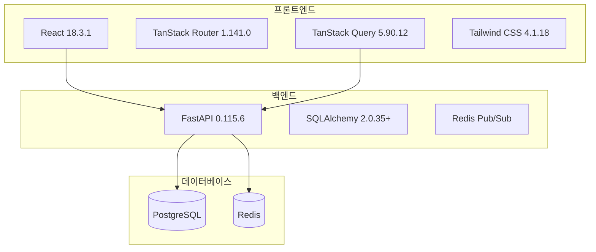

# Focus Mate 기술 스택 문서

**문서 버전**: 1.0
**작성일**: 2025-12-18
**최종 업데이트**: 2025-12-18

---

## 목차

1. [개요](#1-개요)
2. [프론트엔드 기술 스택](#2-프론트엔드-기술-스택)
3. [백엔드 기술 스택](#3-백엔드-기술-스택)
4. [인프라 및 데이터베이스](#4-인프라-및-데이터베이스)
5. [개발 도구](#5-개발-도구)
6. [버전 호환성](#6-버전-호환성)

---

## 1. 개요

Focus Mate는 현대적인 웹 기술 스택을 기반으로 구축된 팀 포모도로 타이머 애플리케이션입니다. 본 문서는 프로젝트에서 사용하는 모든 기술과 라이브러리의 버전 및 선택 이유를 명시합니다.

### 1.1 아키텍처 개요



---

## 2. 프론트엔드 기술 스택

### 2.1 핵심 프레임워크

#### React 18.3.1
- **역할**: UI 라이브러리
- **선택 이유**:
  - 컴포넌트 기반 아키텍처
  - 풍부한 생태계
  - Concurrent 기능 지원
- **주요 기능 사용**:
  - Hooks (useState, useEffect, useCallback, useMemo)
  - Suspense
  - Error Boundaries

#### TypeScript 5.9.3
- **역할**: 정적 타입 시스템
- **선택 이유**:
  - 컴파일 타임 에러 검출
  - IDE 자동완성 지원
  - 코드 품질 향상
- **설정**: Strict 모드 활성화

### 2.2 라우팅 및 상태 관리

#### TanStack Router 1.141.0
- **역할**: 파일 기반 라우팅
- **선택 이유**:
  - 100% 타입 안전 라우팅
  - 파일 시스템 기반 자동 라우트 생성
  - 코드 스플리팅 자동화
- **주요 기능**:
  - 동적 라우팅 (`$roomId`)
  - 레이아웃 라우팅 (`_auth`)
  - Preloading

#### TanStack Query 5.90.12
- **역할**: 서버 상태 관리
- **선택 이유**:
  - 자동 캐싱 및 재검증
  - Optimistic Updates
  - 백그라운드 데이터 동기화
- **주요 기능**:
  - useQuery
  - useMutation
  - Query Invalidation

### 2.3 UI 라이브러리

#### Radix UI
- **역할**: 접근성 우선 UI 컴포넌트
- **주요 컴포넌트**:
  - Dialog (1.1.6)
  - Dropdown Menu (2.1.6)
  - Tooltip (1.1.8)
  - Tabs (1.1.3)
  - Select (2.1.6)
- **선택 이유**:
  - WAI-ARIA 표준 준수
  - 키보드 네비게이션 지원
  - 스타일 자유도

#### Tailwind CSS 4.1.18
- **역할**: 유틸리티 우선 CSS 프레임워크
- **선택 이유**:
  - 빠른 프로토타이핑
  - 일관된 디자인 시스템
  - 작은 번들 크기 (PurgeCSS)
- **플러그인**:
  - tailwindcss-animate (1.0.7)

#### Framer Motion 12.23.26
- **역할**: 애니메이션 라이브러리
- **선택 이유**:
  - 선언적 애니메이션
  - 제스처 지원
  - 레이아웃 애니메이션
- **주요 사용처**:
  - 페이지 전환
  - 모달 애니메이션
  - 차트 애니메이션

### 2.4 데이터 시각화

#### Recharts 2.15.4
- **역할**: React 차트 라이브러리
- **선택 이유**:
  - React 컴포넌트 기반
  - 반응형 디자인
  - 커스터마이징 용이
- **사용 차트**:
  - Area Chart (집중 시간)
  - Bar Chart (주간 활동)
  - Line Chart (월별 비교)
  - Pie Chart (세션 분포)
  - Radar Chart (시간대 패턴)

### 2.5 폼 및 유효성 검사

#### React Hook Form 7.55.0
- **역할**: 폼 상태 관리
- **선택 이유**:
  - 최소 리렌더링
  - 간단한 API
  - Zod 통합

#### Zod 4.1.13
- **역할**: 스키마 유효성 검사
- **선택 이유**:
  - TypeScript 우선 설계
  - 런타임 타입 검증
  - 명확한 에러 메시지

### 2.6 HTTP 클라이언트

#### Axios 1.13.2
- **역할**: HTTP 클라이언트
- **선택 이유**:
  - Interceptor 지원
  - 자동 JSON 변환
  - 요청/응답 변환
- **주요 설정**:
  - Base URL 설정
  - JWT 토큰 자동 주입
  - 에러 핸들링

### 2.7 빌드 도구

#### Vite 6.4.1
- **역할**: 빌드 도구 및 개발 서버
- **선택 이유**:
  - 빠른 HMR (Hot Module Replacement)
  - ES 모듈 기반
  - 최적화된 프로덕션 빌드
- **플러그인**:
  - @vitejs/plugin-react-swc (3.10.2)
  - @tanstack/router-vite-plugin (1.140.5)

---

## 3. 백엔드 기술 스택

### 3.1 웹 프레임워크

#### FastAPI 0.115.6
- **역할**: 비동기 웹 프레임워크
- **선택 이유**:
  - 자동 OpenAPI 문서 생성
  - Pydantic 통합
  - 비동기 I/O 지원
  - Python 3.13 호환
- **주요 기능**:
  - 자동 데이터 유효성 검사
  - 의존성 주입
  - WebSocket 지원

#### Uvicorn 0.34.0
- **역할**: ASGI 서버
- **선택 이유**:
  - 고성능 비동기 서버
  - 자동 리로드 (개발 모드)
  - WebSocket 지원
- **설정**: `--reload --host 0.0.0.0 --port 8000`

### 3.2 데이터베이스 ORM

#### SQLAlchemy 2.0.35+
- **역할**: ORM 및 데이터베이스 툴킷
- **선택 이유**:
  - 비동기 지원 (asyncio)
  - 타입 힌트 지원
  - Python 3.13 호환
- **주요 기능**:
  - Async Session
  - Relationship 매핑
  - Query Builder

**버전 요구사항**: `>=2.0.35,<2.1`
- Python 3.13 호환성 확보
- `AssertionError` 버그 수정

#### asyncpg 0.30.0
- **역할**: PostgreSQL 비동기 드라이버
- **선택 이유**:
  - 고성능 비동기 I/O
  - PostgreSQL 전용 최적화
  - 타입 변환 자동화

#### psycopg2-binary 2.9.11
- **역할**: PostgreSQL 동기 드라이버
- **사용처**: Alembic 마이그레이션
- **선택 이유**: Alembic이 동기 드라이버 필요

#### Alembic 1.14.0
- **역할**: 데이터베이스 마이그레이션
- **선택 이유**:
  - SQLAlchemy 공식 마이그레이션 도구
  - 버전 관리
  - 자동 마이그레이션 생성

### 3.3 인증 및 보안

#### PyJWT 2.10.1
- **역할**: JWT 토큰 생성/검증
- **선택 이유**:
  - 표준 JWT 구현
  - 다양한 알고리즘 지원
  - 만료 시간 관리

#### bcrypt 4.2.1
- **역할**: 비밀번호 해싱
- **선택 이유**:
  - 업계 표준 해싱 알고리즘
  - Salt 자동 생성
  - 조정 가능한 복잡도

#### passlib 1.7.4
- **역할**: 비밀번호 해싱 래퍼
- **선택 이유**:
  - bcrypt 통합
  - 간편한 API
  - 다중 해싱 알고리즘 지원

### 3.4 데이터 유효성 검사

#### Pydantic 2.10.6
- **역할**: 데이터 유효성 검사 및 직렬화
- **선택 이유**:
  - FastAPI 네이티브 통합
  - 자동 타입 변환
  - 명확한 에러 메시지
- **주요 기능**:
  - BaseModel
  - Field validators
  - JSON Schema 생성

#### pydantic-settings 2.7.1
- **역할**: 환경 변수 관리
- **선택 이유**:
  - .env 파일 자동 로드
  - 타입 안전 설정
  - 유효성 검사

### 3.5 실시간 통신

#### FastAPI WebSocket
- **역할**: WebSocket 서버
- **선택 이유**: FastAPI 내장 기능

#### Redis (redis-py)
- **역할**: Pub/Sub 메시징
- **선택 이유**:
  - 다중 인스턴스 지원
  - 메시지 브로드캐스팅
  - 빠른 인메모리 처리

### 3.6 HTTP 클라이언트

#### httpx 0.28.1
- **역할**: 비동기 HTTP 클라이언트
- **선택 이유**:
  - async/await 지원
  - HTTP/2 지원
  - requests와 유사한 API

---

## 4. 인프라 및 데이터베이스

### 4.1 데이터베이스

#### PostgreSQL (Supabase)
- **역할**: 주 데이터베이스
- **선택 이유**:
  - ACID 트랜잭션
  - JSONB 지원
  - 강력한 인덱싱
  - 확장성
- **스키마**: 38개 테이블
- **주요 기능**:
  - UUID 기본 키
  - 외래 키 제약조건
  - 인덱스 최적화

#### Redis
- **역할**: 캐시 및 Pub/Sub
- **사용처**:
  - WebSocket 메시지 브로드캐스팅
  - 세션 캐싱
  - 실시간 알림

### 4.2 파일 스토리지

- **현재**: 로컬 파일 시스템
- **향후**: 클라우드 스토리지 (S3 호환)

### 4.3 이메일

#### SMTP (Gmail)
- **역할**: 이메일 발송
- **사용처**:
  - 인증 요청 알림
  - 팀 초대
  - 비밀번호 재설정

---

## 5. 개발 도구

### 5.1 버전 관리

- **Git**: 소스 코드 버전 관리
- **GitHub**: 원격 저장소

### 5.2 코드 품질

#### 프론트엔드
- **TypeScript**: 정적 타입 검사
- **ESLint**: 코드 린팅 (예정)
- **Prettier**: 코드 포매팅 (예정)

#### 백엔드
- **mypy**: 타입 검사 (예정)
- **pylint**: 코드 린팅 (선택적)
- **black**: 코드 포매팅 (예정)

### 5.3 테스트

#### 프론트엔드
- **Vitest**: 단위 테스트 (예정)
- **React Testing Library**: 컴포넌트 테스트 (예정)

#### 백엔드
- **pytest**: 단위 및 통합 테스트 (예정)
- **pytest-asyncio**: 비동기 테스트 (예정)

---

## 6. 버전 호환성

### 6.1 Python 3.13 호환성

**주요 변경사항**:
- SQLAlchemy 2.0.35+ 필수
- typing-extensions >=4.6.0
- greenlet >=3.0.0

**해결된 문제**:
- `AssertionError` in SQLAlchemy 2.0.23
- Type hint 호환성

### 6.2 Node.js 버전

- **권장**: Node.js 20.x LTS
- **최소**: Node.js 18.x

### 6.3 브라우저 지원

- **Chrome**: 최신 2개 버전
- **Firefox**: 최신 2개 버전
- **Safari**: 최신 2개 버전
- **Edge**: 최신 2개 버전

---

## 7. 의존성 관리

### 7.1 프론트엔드

**패키지 관리자**: npm

**주요 명령어**:
```bash
npm install          # 의존성 설치
npm run dev          # 개발 서버 시작
npm run build        # 프로덕션 빌드
npm run type-check   # TypeScript 타입 검사
```

### 7.2 백엔드

**패키지 관리자**: pip + venv

**주요 명령어**:
```bash
python -m venv .venv              # 가상 환경 생성
source .venv/bin/activate         # 가상 환경 활성화
pip install -r requirements.txt   # 의존성 설치
alembic upgrade head              # 마이그레이션 실행
uvicorn app.main:app --reload     # 개발 서버 시작
```

---

## 8. 보안 고려사항

### 8.1 의존성 보안

- **정기 업데이트**: 월 1회 의존성 버전 검토
- **취약점 스캔**: npm audit, pip-audit
- **버전 고정**: requirements.txt, package.json

### 8.2 환경 변수

- **민감 정보**: .env 파일 (Git 제외)
- **프로덕션**: 환경 변수로 주입
- **필수 변수**:
  - DATABASE_URL
  - JWT_SECRET_KEY
  - SMTP_PASSWORD

---

## 9. 성능 최적화

### 9.1 프론트엔드

- **코드 스플리팅**: TanStack Router 자동 처리
- **이미지 최적화**: WebP 형식
- **번들 크기**: Vite 최적화

### 9.2 백엔드

- **비동기 I/O**: asyncpg, httpx
- **연결 풀링**: SQLAlchemy connection pool
- **캐싱**: Redis

---

## 10. 참고 문서

- [ARC-001: 시스템 아키텍처](file:///Users/juns/FocusMate/docs/02_architecture/ARC-001_System_Architecture.md)
- [REQ-002: API 명세](file:///Users/juns/FocusMate/docs/01_requirements/REQ-002_API_Specification.md)
- [OPS-002: 의존성 수정](file:///Users/juns/FocusMate/docs/05_operations/OPS-002_Dependency_Fix.md)

---

**문서 끝**
