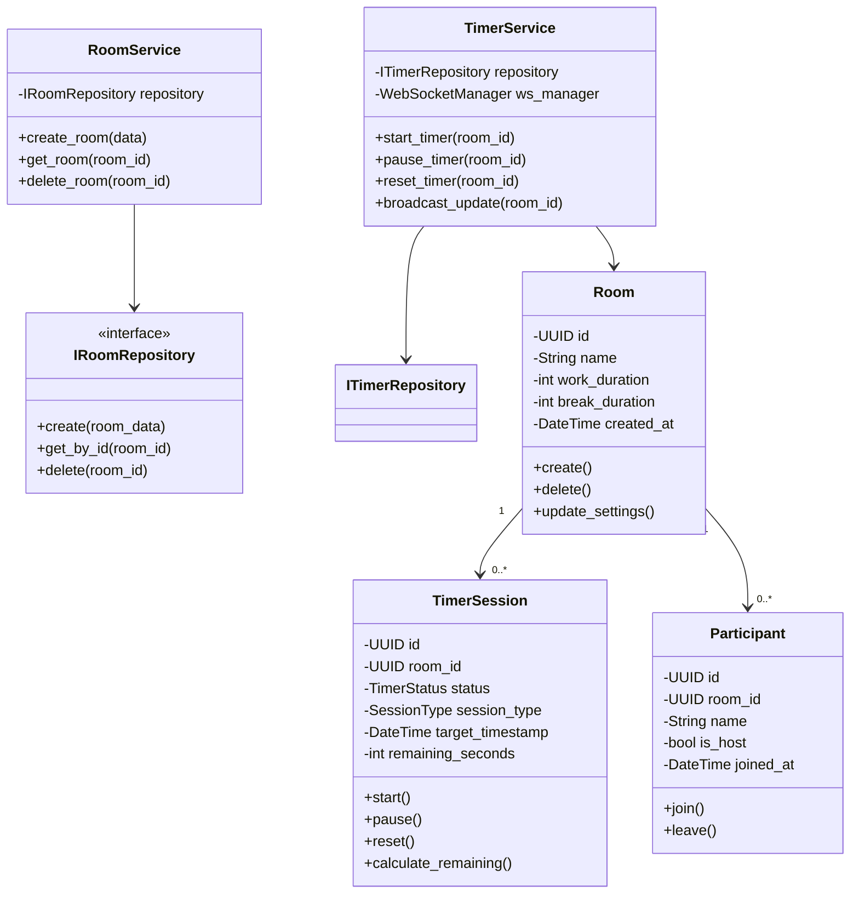
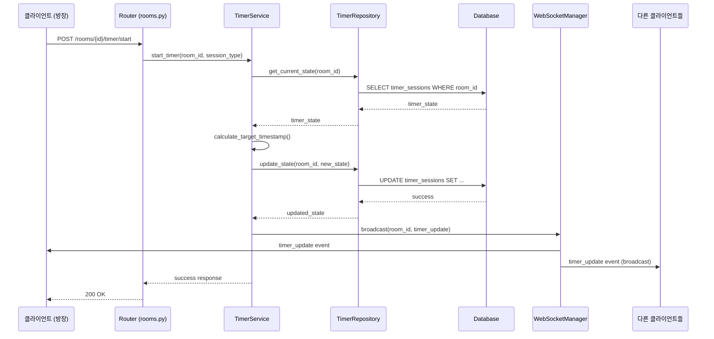
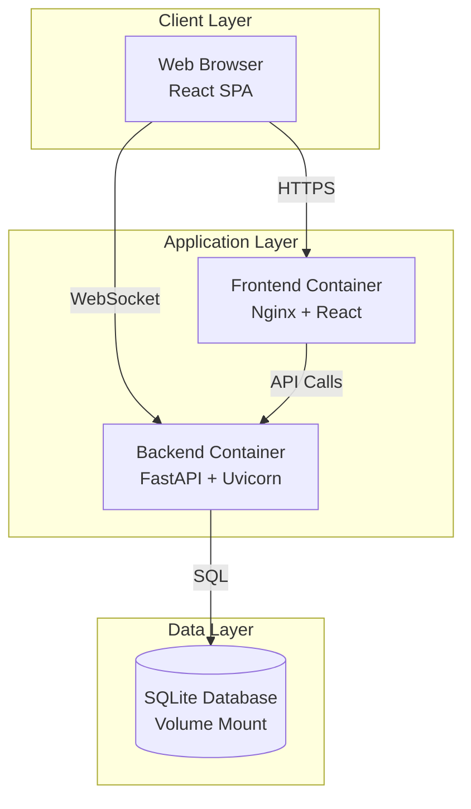
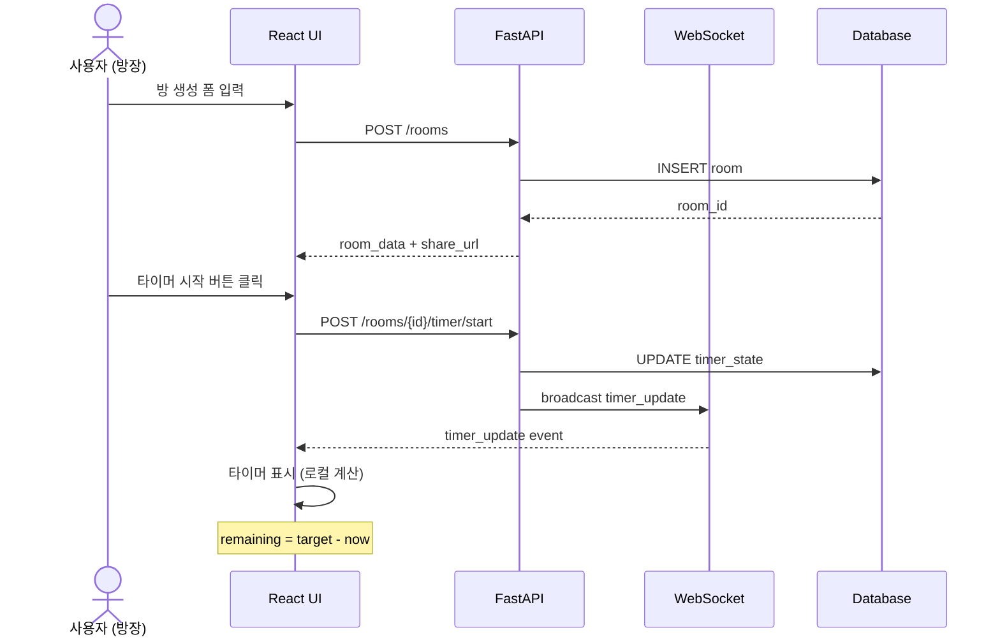
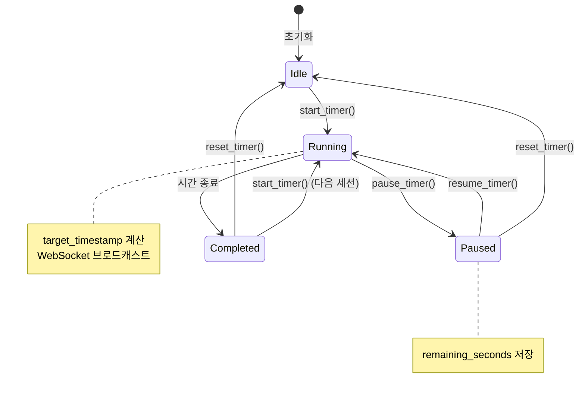
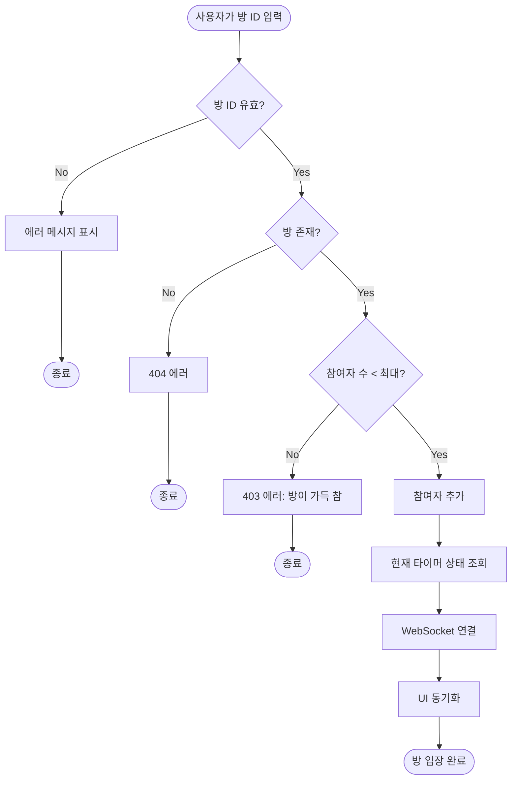

# Software Requirements Specification (SRS)

## Team Pomodoro Timer (Focus Mate)

**문서 버전**: 2.0
**작성일**: 2025-12-04
**표준 준수**: ISO/IEC/IEEE 29148:2018
**V-Model 준수**: Verification & Validation 연계

---

## 목차

1. [서론](#1-서론)
2. [요구사항 계층 구조](#2-요구사항-계층-구조)
3. [비즈니스 요구사항](#3-비즈니스-요구사항)
4. [이해관계자 요구사항](#4-이해관계자-요구사항)
5. [소프트웨어 요구사항](#5-소프트웨어-요구사항)
6. [시스템 모델링](#6-시스템-모델링)
7. [검증 및 확인](#7-검증-및-확인)
8. [요구사항 추적성 매트릭스](#8-요구사항-추적성-매트릭스)

---

## 1. 서론

### 1.1 목적

본 문서는 Team Pomodoro Timer (Focus Mate) 시스템의 소프트웨어 요구사항을 **ISO/IEC/IEEE 29148** 표준에 따라 3계층 구조로 정의합니다:

- **비즈니스 요구사항 (BR)**: 조직의 목표와 전략
- **이해관계자 요구사항 (StR)**: 사용자 관점의 요구사항
- **소프트웨어 요구사항 (SR)**: 구현 가능한 기술적 요구사항

각 요구사항은 **V-Model**에 따라 검증(Verification)과 확인(Validation) 방법을 포함합니다.

### 1.2 범위

**포함 범위**:

- 웹 기반 실시간 협업 포모도로 타이머
- 방 생성/참여/관리
- 서버 기반 타이머 동기화
- 브라우저 알림 및 통계

**제외 범위 (v1.0)**:

- 모바일 네이티브 앱
- 사용자 인증/로그인
- 소셜 기능 (채팅, 댓글)
- 오프라인 모드

### 1.3 정의 및 약어

| 용어            | 정의                                                      |
| :-------------- | :-------------------------------------------------------- |
| **Pomodoro**    | 25분 집중 + 5분 휴식의 시간 관리 기법                     |
| **Room**        | 팀원들이 타이머를 공유하는 가상 공간                      |
| **Session**     | 하나의 포모도로 사이클 (집중 + 휴식)                      |
| **Host**        | 방을 생성한 사용자, 타이머 제어 권한 보유                 |
| **Participant** | 방에 참여한 일반 사용자                                   |
| **WebSocket**   | 실시간 양방향 통신 프로토콜                               |
| **SSOT**        | Single Source of Truth (서버가 타이머 상태의 진실의 원천) |

### 1.4 참조 문서

- ISO/IEC 25010: Software Quality Model
- ISO/IEC/IEEE 29148: Requirements Engineering
- ISO/IEC/IEEE 42010: Architecture Description
- docs/ARCHITECTURE.md: System Architecture Document
- docs/API_SPECIFICATION.md: API Documentation
- docs/TEST_PLAN.md: Test Plan and Strategy

---

## 2. 요구사항 계층 구조

### 2.1 요구사항 계층 다이어그램

```
┌─────────────────────────────────────────┐
│     비즈니스 요구사항 (BR)              │
│     조직 목표, 전략, 가치                │
└──────────────┬──────────────────────────┘
               │ 추적 (Trace)
               ▼
┌─────────────────────────────────────────┐
│     이해관계자 요구사항 (StR)           │
│     사용자 관점, 사용자 스토리           │
└──────────────┬──────────────────────────┘
               │ 추적 (Trace)
               ▼
┌─────────────────────────────────────────┐
│     소프트웨어 요구사항 (SR)             │
│     기능/비기능 요구사항, 구현 명세      │
└─────────────────────────────────────────┘
```

### 2.2 요구사항 ID 체계

| 계층           | ID 형식     | 예시        | 설명            |
| :------------- | :---------- | :---------- | :-------------- |
| **비즈니스**   | `BR-XXX`    | `BR-001`    | 조직 목표       |
| **이해관계자** | `StR-XXX`   | `StR-001`   | 사용자 요구     |
| **소프트웨어** | `SR-F-XXX`  | `SR-F-001`  | 기능 요구사항   |
| **소프트웨어** | `SR-NF-XXX` | `SR-NF-001` | 비기능 요구사항 |

---

## 3. 비즈니스 요구사항

### 3.1 비즈니스 목표

#### BR-001: 원격 팀 생산성 향상

**우선순위**: 높음
**설명**: 원격 근무 환경에서 팀원들의 집중력과 생산성을 향상시키기 위한 협업 도구 제공

**비즈니스 가치**:

- 팀원 간 시간 동기화로 집중력 향상
- 포모도로 기법을 통한 체계적 시간 관리
- 원격 협업 시 공동 목표 의식 강화

**성공 지표**:

- 월간 활성 사용자 수 > 1,000명
- 평균 세션 완료율 > 80%
- 사용자 만족도 > 4.5/5.0

**검증 방법 (Validation)**:

- 사용자 설문조사 (월간)
- 세션 완료율 통계 분석
- 사용자 피드백 수집

---

#### BR-002: 기술적 우수성 확보

**우선순위**: 높음
**설명**: ISO/IEC 25010 품질 모델 준수를 통한 소프트웨어 품질 확보

**비즈니스 가치**:

- 유지보수 비용 절감
- 확장 가능한 아키텍처
- AI 평가에서 높은 점수 획득

**성공 지표**:

- 테스트 커버리지 > 90%
- 코드 복잡도 < 10
- 타입 안정성 100%

**검증 방법 (Verification)**:

- CI/CD 자동화된 품질 게이트
- 정적 분석 도구 (mypy, ESLint)
- 코드 리뷰 체크리스트

---

### 3.2 비즈니스 규칙

#### BR-003: 데이터 보존 정책

**설명**: 방 삭제 시 모든 관련 데이터는 즉시 삭제되어야 함

**규칙**:

- 방 삭제 → 타이머 상태, 참여자 목록, 세션 히스토리 모두 삭제
- 개인정보 수집 최소화 (v1.0: 이름만 수집)

---

## 4. 이해관계자 요구사항

### 4.1 이해관계자 정의

| 이해관계자               | 역할        | 관심사                     |
| :----------------------- | :---------- | :------------------------- |
| **원격 근무자**          | 주 사용자   | 팀과 함께 집중 시간 관리   |
| **프리랜서**             | 주 사용자   | 개인 생산성 향상           |
| **학습 그룹**            | 주 사용자   | 공동 학습 시간 동기화      |
| **방장 (Host)**          | 특권 사용자 | 방 생성 및 타이머 제어     |
| **참여자 (Participant)** | 일반 사용자 | 타이머 상태 확인 및 동기화 |

### 4.2 사용자 스토리

#### StR-001: 방 생성 (방장 관점)

**As a** 방장
**I want to** 고유한 이름으로 팀 방을 생성하고
**So that** 팀원들을 초대하여 함께 포모도로 세션을 진행할 수 있다

**수용 기준 (Acceptance Criteria)**:

- [ ] 방 이름은 3-50자, 영문/숫자/하이픈/언더스코어만 허용
- [ ] 방 생성 시 고유한 공유 URL 자동 생성
- [ ] 방 생성자는 자동으로 방장 권한 획득
- [ ] 집중 시간, 휴식 시간 설정 가능

**검증 방법 (Validation)**:

- 사용자 테스트: 방 생성 시나리오 실행
- E2E 테스트: `TC-ROOM-001`

**추적**: `BR-001` → `StR-001` → `SR-F-001`

---

#### StR-002: 방 참여 (참여자 관점)

**As a** 참여자
**I want to** 공유 URL을 통해 기존 방에 참여하고
**So that** 팀과 함께 타이머를 공유할 수 있다

**수용 기준**:

- [ ] 존재하지 않는 방 접근 시 명확한 에러 메시지
- [ ] 방 입장 시 현재 타이머 상태 즉시 동기화
- [ ] 최대 참여 인원 제한 (50명)

**검증 방법**:

- 사용자 테스트: 방 참여 시나리오 실행
- E2E 테스트: `TC-ROOM-002`

**추적**: `BR-001` → `StR-002` → `SR-F-002`

---

#### StR-003: 실시간 타이머 동기화 (모든 사용자)

**As a** 사용자
**I want to** 방의 모든 참여자와 정확히 동일한 타이머 상태를 공유하고
**So that** 팀 전체가 동시에 집중하고 휴식할 수 있다

**수용 기준**:

- [ ] 클라이언트 간 타이머 오차 < 1초
- [ ] 네트워크 지연 200ms 환경에서도 정확성 유지
- [ ] 브라우저 탭 비활성화 시에도 정확한 시간 표시

**검증 방법**:

- 성능 테스트: 다중 클라이언트 동시 접속 시나리오
- 통합 테스트: `TC-TIMER-001`

**추적**: `BR-001` → `StR-003` → `SR-F-004`

---

#### StR-004: 타이머 제어 (방장 관점)

**As a** 방장
**I want to** 타이머를 시작, 일시정지, 재설정할 수 있고
**So that** 팀의 집중 시간을 효과적으로 관리할 수 있다

**수용 기준**:

- [ ] 방장만 타이머 제어 가능 (기본 설정)
- [ ] 타이머 상태 변경이 모든 참여자에게 즉시 전파
- [ ] 일시정지 시 남은 시간 정확히 저장

**검증 방법**:

- 통합 테스트: `TC-TIMER-002`, `TC-TIMER-003`
- 사용자 테스트: 권한 검증 시나리오

**추적**: `BR-001` → `StR-004` → `SR-F-005`, `SR-F-006`, `SR-F-007`

---

## 5. 소프트웨어 요구사항

### 5.1 기능 요구사항 (Functional Requirements)

#### SR-F-001: 방 생성

**우선순위**: 높음
**추적**: `StR-001` → `SR-F-001`

**설명**: 사용자는 고유한 이름으로 팀 방을 생성할 수 있어야 한다.

**상세 요구사항**:

1. **입력 검증**:

   - 방 이름: 3-50자, 패턴 `^[a-zA-Z0-9_-]+$`
   - 집중 시간: 1-60분 (기본 25분)
   - 휴식 시간: 1-30분 (기본 5분)

2. **비즈니스 로직**:

   - 방 생성 시 UUID v4로 고유 ID 생성
   - 방 생성자는 자동으로 방장 권한 획득
   - 초기 타이머 상태: `idle`, `session_type: focus`

3. **출력**:
   - 방 ID, 이름, 공유 URL 반환
   - 생성 시각 기록

**API 명세**:

```http
POST /api/v1/rooms
Content-Type: application/json

{
  "room_name": "team-alpha",
  "work_duration_minutes": 25,
  "break_duration_minutes": 5,
  "auto_start_break": false
}
```

**응답 (201 Created)**:

```json
{
  "status": "success",
  "data": {
    "room_id": "550e8400-e29b-41d4-a716-446655440000",
    "room_name": "team-alpha",
    "share_url": "http://localhost:3000/room/550e8400-e29b-41d4-a716-446655440000",
    "work_duration": 1500,
    "break_duration": 300,
    "created_at": "2025-12-04T10:00:00Z"
  },
  "message": "Room created successfully"
}
```

**검증 조건 (Verification)**:

| 검증 항목 | 검증 방법            | 테스트 케이스    |
| :-------- | :------------------- | :--------------- |
| 입력 검증 | Pydantic Strict 모드 | `TC-ROOM-001-01` |
| UUID 생성 | 단위 테스트          | `TC-ROOM-001-02` |
| DB 저장   | 통합 테스트          | `TC-ROOM-001-03` |
| 응답 포맷 | API 테스트           | `TC-ROOM-001-04` |

**확인 조건 (Validation)**:

| 확인 항목   | 확인 방법            | 사용자 테스트 |
| :---------- | :------------------- | :------------ |
| 사용자 경험 | 사용성 테스트        | `UT-ROOM-001` |
| 에러 처리   | 에러 시나리오 테스트 | `UT-ROOM-002` |

---

#### SR-F-002: 방 참여

**우선순위**: 높음
**추적**: `StR-002` → `SR-F-002`

**설명**: 사용자는 공유 URL 또는 방 ID를 통해 기존 방에 참여할 수 있어야 한다.

**상세 요구사항**:

1. **입력 검증**:

   - 방 ID: UUID v4 형식
   - 참여자 이름: 1-50자

2. **비즈니스 로직**:

   - 존재하지 않는 방 접근 시 404 에러
   - 최대 참여 인원 초과 시 403 에러
   - 방 입장 시 현재 타이머 상태 즉시 반환

3. **출력**:
   - 방 정보, 현재 참여자 수, 타이머 상태

**API 명세**:

```http
GET /api/v1/rooms/{room_id}
```

**응답 (200 OK)**:

```json
{
  "status": "success",
  "data": {
    "room_id": "550e8400-e29b-41d4-a716-446655440000",
    "room_name": "team-alpha",
    "current_participants": 3,
    "max_participants": 50,
    "timer_state": {
      "status": "running",
      "session_type": "work",
      "remaining_seconds": 1234,
      "target_timestamp": "2025-12-04T10:25:00Z"
    }
  }
}
```

**검증 조건**:

| 검증 항목          | 검증 방법   | 테스트 케이스    |
| :----------------- | :---------- | :--------------- |
| 방 존재 확인       | 단위 테스트 | `TC-ROOM-002-01` |
| 참여자 수 제한     | 통합 테스트 | `TC-ROOM-002-02` |
| 타이머 상태 동기화 | 통합 테스트 | `TC-ROOM-002-03` |

---

#### SR-F-003: 방 나가기 및 삭제

**우선순위**: 중간
**추적**: `StR-002` → `SR-F-003`

**설명**: 사용자는 방을 나갈 수 있으며, 방장은 방을 삭제할 수 있어야 한다.

**상세 요구사항**:

1. **일반 사용자 나가기**:

   - 참여자 목록에서 제거
   - 다른 참여자에게 영향 없음

2. **방장 삭제**:
   - 방 삭제 시 모든 참여자 강제 퇴장
   - 관련 데이터 모두 삭제 (CASCADE)

**검증 조건**:

| 검증 항목    | 검증 방법   | 테스트 케이스    |
| :----------- | :---------- | :--------------- |
| 권한 검증    | 단위 테스트 | `TC-ROOM-003-01` |
| CASCADE 삭제 | 통합 테스트 | `TC-ROOM-003-02` |

---

#### SR-F-004: 실시간 타이머 동기화

**우선순위**: 높음 (핵심 기능)
**추적**: `StR-003` → `SR-F-004`

**설명**: 방에 참여한 모든 사용자는 서버 기준의 단일 타이머 상태를 실시간으로 공유받아야 한다.

**상세 요구사항**:

1. **동기화 아키텍처**:

   - 서버가 진실의 원천 (SSOT)
   - 클라이언트는 `target_timestamp`를 받아 로컬 계산
   - 계산식: `remaining_time = target_timestamp - current_time`

2. **WebSocket 프로토콜**:

   - 연결: `WS /ws/{room_id}`
   - 이벤트: `timer_update`, `timer_tick`, `timer_complete`
   - 재연결: 지수 백오프 (최대 30초)

3. **정확성 요구사항**:
   - 클라이언트 간 오차 < 1초
   - 네트워크 지연 200ms 환경에서도 유지
   - 브라우저 탭 비활성화 시에도 정확성 유지

**WebSocket 메시지 포맷**:

**서버 → 클라이언트 (타이머 업데이트)**:

```json
{
  "event": "timer_update",
  "room_id": "550e8400-e29b-41d4-a716-446655440000",
  "data": {
    "status": "running",
    "session_type": "work",
    "target_timestamp": "2025-12-04T10:25:00Z",
    "started_at": "2025-12-04T10:00:00Z",
    "work_duration": 1500,
    "break_duration": 300
  },
  "timestamp": "2025-12-04T10:00:00Z"
}
```

**클라이언트 → 서버 (타이머 제어)**:

```json
{
  "action": "start_timer",
  "room_id": "550e8400-e29b-41d4-a716-446655440000",
  "session_type": "work",
  "timestamp": "2025-12-04T10:00:00Z"
}
```

**검증 조건**:

| 검증 항목          | 검증 방법                    | 테스트 케이스     |
| :----------------- | :--------------------------- | :---------------- |
| 동기화 정확성      | 성능 테스트 (50명 동시 접속) | `TC-TIMER-001-01` |
| 네트워크 지연 처리 | 통합 테스트 (인위적 지연)    | `TC-TIMER-001-02` |
| 재연결 복원        | 통합 테스트                  | `TC-TIMER-001-03` |
| 탭 비활성화 처리   | E2E 테스트                   | `TC-TIMER-001-04` |

**확인 조건**:

| 확인 항목          | 확인 방법          | 사용자 테스트  |
| :----------------- | :----------------- | :------------- |
| 사용자 체감 정확성 | 실제 사용 시나리오 | `UT-TIMER-001` |

---

#### SR-F-005: 타이머 시작

**우선순위**: 높음
**추적**: `StR-004` → `SR-F-005`

**설명**: 권한이 있는 사용자는 타이머를 시작할 수 있어야 한다.

**상세 요구사항**:

1. **권한 관리**:

   - 기본: 방장만 시작 가능
   - 옵션: 모든 참여자 시작 가능 (방 설정)

2. **비즈니스 로직**:
   - 이미 실행 중인 타이머 재시작 시 경고 메시지
   - 시작 시 `target_timestamp` 계산 및 저장
   - WebSocket으로 모든 클라이언트에 브로드캐스트

**API 명세**:

```http
POST /api/v1/rooms/{room_id}/timer/start
Content-Type: application/json

{
  "session_type": "work"
}
```

**검증 조건**:

| 검증 항목              | 검증 방법   | 테스트 케이스     |
| :--------------------- | :---------- | :---------------- |
| 권한 검증              | 단위 테스트 | `TC-TIMER-002-01` |
| target_timestamp 계산  | 단위 테스트 | `TC-TIMER-002-02` |
| WebSocket 브로드캐스트 | 통합 테스트 | `TC-TIMER-002-03` |

---

#### SR-F-006: 타이머 일시정지

**우선순위**: 높음
**추적**: `StR-004` → `SR-F-006`

**설명**: 권한이 있는 사용자는 타이머를 일시정지할 수 있어야 한다.

**상세 요구사항**:

1. **일시정지 로직**:

   - 현재 남은 시간 계산 및 저장
   - 상태를 `paused`로 변경
   - 모든 클라이언트에 즉시 전파

2. **재개 로직**:
   - 저장된 남은 시간부터 계속 진행
   - 새로운 `target_timestamp` 계산

**검증 조건**:

| 검증 항목      | 검증 방법   | 테스트 케이스     |
| :------------- | :---------- | :---------------- |
| 남은 시간 저장 | 단위 테스트 | `TC-TIMER-003-01` |
| 재개 정확성    | 통합 테스트 | `TC-TIMER-003-02` |

---

#### SR-F-007: 타이머 재설정

**우선순위**: 중간
**추적**: `StR-004` → `SR-F-007`

**설명**: 권한이 있는 사용자는 타이머를 초기 상태로 재설정할 수 있어야 한다.

**상세 요구사항**:

1. **재설정 로직**:

   - 진행 중인 세션 데이터 저장 (통계용)
   - 타이머를 설정된 초기 시간으로 리셋
   - 상태를 `idle`로 변경

2. **사용자 확인**:
   - 프론트엔드에서 확인 다이얼로그 표시 (실수 방지)

**검증 조건**:

| 검증 항목        | 검증 방법   | 테스트 케이스     |
| :--------------- | :---------- | :---------------- |
| 초기 상태 복원   | 단위 테스트 | `TC-TIMER-004-01` |
| 세션 데이터 저장 | 통합 테스트 | `TC-TIMER-004-02` |

---

#### SR-F-008: 포모도로 설정

**우선순위**: 중간
**추적**: `StR-001` → `SR-F-008`

**설명**: 사용자는 집중 시간과 휴식 시간을 커스터마이징할 수 있어야 한다.

**상세 요구사항**:

1. **설정 범위**:

   - 집중 시간: 1-60분 (기본 25분)
   - 휴식 시간: 1-30분 (기본 5분)
   - 긴 휴식 시간: 1-60분 (기본 15분, 4세션마다)

2. **자동 시작 옵션**:
   - 휴식 후 자동으로 다음 세션 시작

**검증 조건**:

| 검증 항목      | 검증 방법   | 테스트 케이스      |
| :------------- | :---------- | :----------------- |
| 입력 범위 검증 | 단위 테스트 | `TC-CONFIG-001-01` |
| 설정 저장      | 통합 테스트 | `TC-CONFIG-001-02` |

---

#### SR-F-009: 타이머 종료 알림

**우선순위**: 중간
**추적**: `StR-003` → `SR-F-009`

**설명**: 타이머 종료 시 사용자에게 알림을 제공해야 한다.

**상세 요구사항**:

1. **알림 방식**:

   - 브라우저 알림 (Notification API)
   - 소리 알림 (선택 가능)
   - 탭 타이틀 깜빡임 (백그라운드 탭)

2. **알림 메시지**:
   - 집중 시간 종료: "🎉 집중 시간 완료! 휴식 시간입니다."
   - 휴식 시간 종료: "⏰ 휴식 종료! 다음 세션을 시작하세요."

**검증 조건**:

| 검증 항목     | 검증 방법  | 테스트 케이스     |
| :------------ | :--------- | :---------------- |
| 브라우저 알림 | E2E 테스트 | `TC-NOTIF-001-01` |
| 소리 알림     | E2E 테스트 | `TC-NOTIF-001-02` |

---

### 5.2 비기능 요구사항 (Non-Functional Requirements)

#### SR-NF-001: API 응답 시간

**우선순위**: 높음
**추적**: `BR-002` → `SR-NF-001`

**설명**: REST API의 95분위(p95) 응답 시간은 200ms 이하여야 한다.

**측정 방법**:

- Load Testing: Locust 또는 k6 사용
- 모니터링: Prometheus + Grafana

**검증 조건**:

| 검증 항목     | 검증 방법             | 테스트 케이스    |
| :------------ | :-------------------- | :--------------- |
| p95 응답 시간 | 성능 테스트           | `TC-PERF-001-01` |
| 부하 테스트   | 부하 테스트 (100 RPS) | `TC-PERF-001-02` |

---

#### SR-NF-002: WebSocket 지연

**우선순위**: 높음
**추적**: `SR-F-004` → `SR-NF-002`

**설명**: 타이머 상태 변경 이벤트 전파 지연은 100ms 이하여야 한다.

**검증 조건**:

| 검증 항목        | 검증 방법                    | 테스트 케이스    |
| :--------------- | :--------------------------- | :--------------- |
| 이벤트 전파 지연 | 성능 테스트 (50명 동시 접속) | `TC-PERF-002-01` |

---

#### SR-NF-003: 타입 안정성

**우선순위**: 높음
**추적**: `BR-002` → `SR-NF-003`

**설명**: 모든 코드는 엄격한 타입 검사를 통과해야 한다.

**메트릭**:

- Python: mypy --strict 통과 (Any 타입 0개)
- TypeScript: strict: true, 타입 에러 0개

**검증 조건**:

| 검증 항목       | 검증 방법    | 테스트 케이스       |
| :-------------- | :----------- | :------------------ |
| mypy 검증       | CI/CD 자동화 | `TC-QUALITY-001-01` |
| TypeScript 검증 | CI/CD 자동화 | `TC-QUALITY-001-02` |

---

#### SR-NF-004: 테스트 커버리지

**우선순위**: 높음
**추적**: `BR-002` → `SR-NF-004`

**설명**: 코드 커버리지는 90% 이상이어야 한다.

**메트릭**:

- 라인 커버리지 > 90%
- 분기 커버리지 > 85%

**검증 조건**:

| 검증 항목     | 검증 방법    | 테스트 케이스       |
| :------------ | :----------- | :------------------ |
| 커버리지 측정 | CI/CD 자동화 | `TC-QUALITY-002-01` |

---

#### SR-NF-005: 코드 복잡도

**우선순위**: 높음
**추적**: `BR-002` → `SR-NF-005`

**설명**: 함수당 Cyclomatic Complexity는 10 미만이어야 한다.

**검증 조건**:

| 검증 항목   | 검증 방법    | 테스트 케이스       |
| :---------- | :----------- | :------------------ |
| 복잡도 분석 | CI/CD 자동화 | `TC-QUALITY-003-01` |

---

## 6. 시스템 모델링

### 6.1 4+1 아키텍처 뷰

ISO/IEC/IEEE 42010에 따른 아키텍처 뷰:

#### 6.1.1 논리적 뷰 (Logical View) - 정적 관점, 화이트박스

**클래스 다이어그램**:



---

#### 6.1.2 프로세스 뷰 (Process View) - 동적 관점, 화이트박스

**타이머 시작 시퀀스 다이어그램**:



---

#### 6.1.3 개발 뷰 (Development View) - 정적 관점, 화이트박스

**모듈 구조 다이어그램**:

```
src/backend/app/
├── routers/              # API 엔드포인트
│   ├── rooms.py         # 방 관리
│   ├── timer.py         # 타이머 제어
│   └── websocket.py     # WebSocket 연결
├── services/            # 비즈니스 로직
│   ├── room_service.py
│   └── timer_service.py
├── repositories/        # 데이터 액세스
│   ├── interfaces/      # 추상 인터페이스
│   └── implementations/ # 구현체
└── db/                  # 데이터베이스
    └── models.py        # ORM 모델
```

---

#### 6.1.4 물리적 뷰 (Physical View) - 정적 관점, 블랙박스

**배포 다이어그램**:



---

#### 6.1.5 시나리오 뷰 (Scenarios) - 동적 관점, 블랙박스

**사용자 시나리오: 방 생성 및 타이머 시작**



---

### 6.2 상태 다이어그램 (State Diagram) - 동적 관점, 화이트박스

**타이머 상태 전이**:



---

### 6.3 활동 다이어그램 (Activity Diagram) - 동적 관점, 화이트박스

**방 참여 프로세스**:



---

## 7. 검증 및 확인

### 7.1 V-Model 매핑

V-Model에 따른 개발 단계와 테스트 단계 매핑:

| 개발 단계                 | 테스트 단계             | 검증/확인                 | 요구사항 ID                  |
| :------------------------ | :---------------------- | :------------------------ | :--------------------------- |
| **User Requirements**     | **Acceptance Testing**  | Validation                | BR-001, BR-002               |
| **Software Requirements** | **System Testing**      | Validation & Verification | SR-F-001 ~ SR-F-009          |
| **Software Architecture** | **Integration Testing** | Verification              | SR-F-004 (WebSocket)         |
| **Software Design**       | **Unit Testing**        | Verification              | SR-F-005, SR-F-006, SR-F-007 |
| **Implementation**        | **Static Analysis**     | Verification              | SR-NF-003, SR-NF-005         |

---

### 7.2 검증 방법 (Verification)

**검증**: "제대로 만들었는가?" (Are we building it right?)

| 요구사항  | 검증 방법     | 테스트 케이스     | 도구               |
| :-------- | :------------ | :---------------- | :----------------- |
| SR-F-001  | 단위 테스트   | TC-ROOM-001-01    | pytest             |
| SR-F-004  | 통합 테스트   | TC-TIMER-001-01   | pytest + WebSocket |
| SR-NF-001 | 성능 테스트   | TC-PERF-001-01    | k6, Locust         |
| SR-NF-003 | 정적 분석     | TC-QUALITY-001-01 | mypy, tsc          |
| SR-NF-004 | 커버리지 분석 | TC-QUALITY-002-01 | pytest-cov, jest   |

---

### 7.3 확인 방법 (Validation)

**확인**: "올바른 것을 만들었는가?" (Are we building the right thing?)

| 요구사항 | 확인 방법          | 사용자 테스트   | 대상        |
| :------- | :----------------- | :-------------- | :---------- |
| BR-001   | 사용자 설문조사    | UT-BUSINESS-001 | 원격 근무자 |
| StR-001  | 사용성 테스트      | UT-ROOM-001     | 방장        |
| StR-003  | 실제 사용 시나리오 | UT-TIMER-001    | 모든 사용자 |
| SR-F-009 | 사용자 피드백      | UT-NOTIF-001    | 모든 사용자 |

---

## 8. 요구사항 추적성 매트릭스

### 8.1 전체 추적성 매트릭스

| 비즈니스 요구사항 | 이해관계자 요구사항 | 소프트웨어 요구사항 | 테스트 케이스  | 검증 방법        | 확인 방법          | 상태   |
| :---------------- | :------------------ | :------------------ | :------------- | :--------------- | :----------------- | :----- |
| BR-001            | StR-001             | SR-F-001            | TC-ROOM-001    | 단위/통합 테스트 | 사용성 테스트      | 미구현 |
| BR-001            | StR-002             | SR-F-002            | TC-ROOM-002    | 단위/통합 테스트 | 사용성 테스트      | 미구현 |
| BR-001            | StR-003             | SR-F-004            | TC-TIMER-001   | 통합/성능 테스트 | 실제 사용 시나리오 | 미구현 |
| BR-001            | StR-004             | SR-F-005            | TC-TIMER-002   | 단위/통합 테스트 | 사용자 테스트      | 미구현 |
| BR-001            | StR-004             | SR-F-006            | TC-TIMER-003   | 단위/통합 테스트 | 사용자 테스트      | 미구현 |
| BR-001            | StR-004             | SR-F-007            | TC-TIMER-004   | 단위/통합 테스트 | 사용자 테스트      | 미구현 |
| BR-001            | StR-001             | SR-F-008            | TC-CONFIG-001  | 단위 테스트      | 사용성 테스트      | 미구현 |
| BR-001            | StR-003             | SR-F-009            | TC-NOTIF-001   | E2E 테스트       | 사용자 피드백      | 미구현 |
| BR-002            | -                   | SR-NF-001           | TC-PERF-001    | 성능 테스트      | -                  | 미구현 |
| BR-002            | -                   | SR-NF-002           | TC-PERF-002    | 성능 테스트      | -                  | 미구현 |
| BR-002            | -                   | SR-NF-003           | TC-QUALITY-001 | 정적 분석        | -                  | 미구현 |
| BR-002            | -                   | SR-NF-004           | TC-QUALITY-002 | 커버리지 분석    | -                  | 미구현 |
| BR-002            | -                   | SR-NF-005           | TC-QUALITY-003 | 복잡도 분석      | -                  | 미구현 |

---

### 8.2 테스트 케이스 매핑

| 테스트 케이스 ID | 요구사항 ID | 테스트 유형 | 우선순위 | 설명                 |
| :--------------- | :---------- | :---------- | :------- | :------------------- |
| TC-ROOM-001      | SR-F-001    | 단위/통합   | 높음     | 방 생성 검증         |
| TC-ROOM-002      | SR-F-002    | 단위/통합   | 높음     | 방 참여 검증         |
| TC-TIMER-001     | SR-F-004    | 통합/성능   | 높음     | 타이머 동기화 정확성 |
| TC-TIMER-002     | SR-F-005    | 단위/통합   | 높음     | 타이머 시작          |
| TC-TIMER-003     | SR-F-006    | 단위/통합   | 높음     | 타이머 일시정지      |
| TC-TIMER-004     | SR-F-007    | 단위/통합   | 중간     | 타이머 재설정        |
| TC-CONFIG-001    | SR-F-008    | 단위        | 중간     | 포모도로 설정        |
| TC-NOTIF-001     | SR-F-009    | E2E         | 중간     | 알림 기능            |
| TC-PERF-001      | SR-NF-001   | 성능        | 높음     | API 응답 시간        |
| TC-PERF-002      | SR-NF-002   | 성능        | 높음     | WebSocket 지연       |
| TC-QUALITY-001   | SR-NF-003   | 정적 분석   | 높음     | 타입 안정성          |
| TC-QUALITY-002   | SR-NF-004   | 커버리지    | 높음     | 테스트 커버리지      |
| TC-QUALITY-003   | SR-NF-005   | 복잡도      | 높음     | 코드 복잡도          |

---

## 9. 부록

### 9.1 변경 이력

| 버전 | 날짜       | 작성자  | 변경 내용                        |
| :--- | :--------- | :------ | :------------------------------- |
| 1.0  | 2025-12-04 | AI Team | 초기 버전 작성                   |
| 2.0  | 2025-12-04 | AI Team | 3계층 구조, V-Model, 모델링 추가 |

### 9.2 승인

- [ ] 프로젝트 관리자
- [ ] 기술 리드
- [ ] QA 리드
- [ ] 이해관계자 대표

---

**문서 끝**
