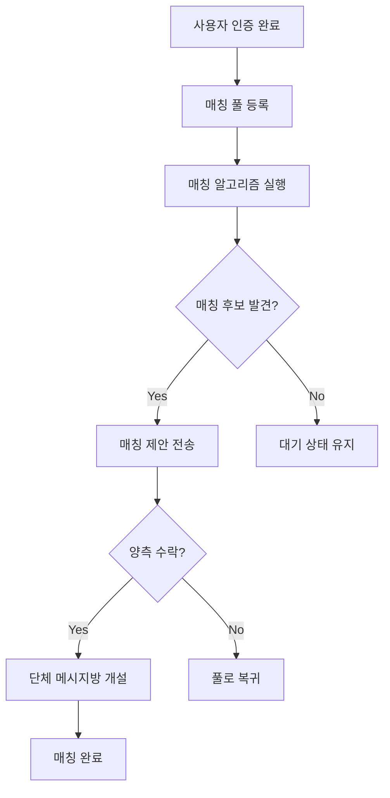

# REQ-002: 과팅 매칭 시스템 요구사항 명세서

## 📋 문서 정보
- **문서 번호**: REQ-002
- **작성일**: 2025-12-12
- **버전**: 1.0
- **상태**: 초안

## 🎯 개요

### 목적
검증된 대학생 사용자 간 학과/전공 기반 그룹 매칭 시스템을 제공하여 건전한 대학생 교류 문화를 조성한다.

### 범위
- 사용자 인증 시스템 (학과, 학년 검증)
- 프로필 인증 배지 시스템
- 그룹 매칭 시스템 (과팅)
- 매칭 알림 및 수락/거절 시스템
- 단체 메시지 자동 개설

## 👤 1. 사용자 인증 시스템

### 1.1 인증 프로세스

#### 기존 랭킹전 검증 확장
```
기존: 팀 검증 (학교 인증서 업로드)
추가: 개인 검증 (학과, 학년 정보)
```

#### 인증 단계
1. **사용자 정보 입력**
   - 학교명 (기존 랭킹전 검증 데이터 활용)
   - 학과명 (선택 입력)
   - 학년 (1~4학년, 대학원)
   - 학번 (선택 입력)
   - 성별 (필수)

2. **서류 제출**
   - 학생증 사진 (얼굴 가림 가능)
   - 재학증명서 (선택)

3. **관리자 검토**
   - 제출 서류 확인
   - 학과/학년 정보 검증
   - 승인/반려 결정

4. **인증 완료**
   - 인증 배지 부여
   - 프로필에 인증 마크 표시

### 1.2 데이터베이스 스키마

#### `user_verification` 테이블
```sql
CREATE TABLE user_verification (
    verification_id UUID PRIMARY KEY DEFAULT gen_random_uuid(),
    user_id VARCHAR(36) REFERENCES "user"(id) ON DELETE CASCADE,

    -- 학교 정보
    school_name VARCHAR(100) NOT NULL,

    -- 학과 정보
    department VARCHAR(100) NOT NULL,
    major_category VARCHAR(50), -- 공과대학, 상경계, 인문계 등

    -- 학년 정보
    grade VARCHAR(20) NOT NULL, -- 1학년, 2학년, 3학년, 4학년, 대학원
    student_id VARCHAR(20), -- 학번 (선택)

    -- 개인 정보
    gender VARCHAR(10) NOT NULL, -- male, female, other

    -- 검증 정보
    verification_status VARCHAR(20) DEFAULT 'pending', -- pending, approved, rejected
    submitted_documents TEXT[], -- 제출 서류 URL 배열
    admin_note TEXT,

    -- 노출 설정
    badge_visible BOOLEAN DEFAULT true, -- 인증 배지 표시 여부
    department_visible BOOLEAN DEFAULT true, -- 학과 표시 여부

    -- 타임스탬프
    submitted_at TIMESTAMP DEFAULT CURRENT_TIMESTAMP,
    verified_at TIMESTAMP,

    UNIQUE(user_id)
);

CREATE INDEX idx_user_verification_status ON user_verification(verification_status);
CREATE INDEX idx_user_verification_department ON user_verification(department);
CREATE INDEX idx_user_verification_grade ON user_verification(grade);
```

## 🎖️ 2. 인증 배지 시스템

### 2.1 배지 표시 규칙

#### 프로필 페이지
```
[사용자 이름] ✓ [학과명]
예: 김철수 ✓ 컴퓨터공학과
```

#### 전체 섹션 표시
- 채팅 메시지
- 댓글
- 랭킹 리더보드
- 팀 멤버 목록

### 2.2 노출 설정

#### 사용자 제어 옵션
1. **인증 배지 표시**: ON/OFF
   - OFF: 인증 마크(✓) 숨김

2. **학과 표시**: ON/OFF
   - OFF: 학과명 숨김, 인증 마크만 표시

#### 설정 조합 예시
```
배지 ON + 학과 ON:  김철수 ✓ 컴퓨터공학과
배지 ON + 학과 OFF: 김철수 ✓
배지 OFF:           김철수
```

## 💑 3. 과팅 매칭 시스템

### 3.1 시스템 개요

#### 핵심 기능
- 학과/전공 기반 그룹 매칭
- 블라인드/공개 매칭 선택
- 인원수 기반 자동 매칭
- 수락/거절 시스템
- 단체 메시지 자동 개설

### 3.2 매칭 풀 등록

#### 등록 정보
```typescript
interface MatchingPoolEntry {
  // 기본 정보
  groupId: string;
  creatorId: string;

  // 그룹 정보
  memberCount: number; // 2~8명
  members: string[]; // 참여자 user_id 배열

  // 학과 정보
  department: string;
  grade: string;

  // 매칭 선호도
  preferredMatchType: 'any' | 'same_department' | 'major_category'; // 무관/학과/전공
  preferredCategories?: string[]; // 복수 선택 가능

  // 공개 설정
  matchingType: 'blind' | 'open'; // 블라인드/공개

  // 메모
  message: string; // 1~2문장 (최대 200자)

  // 상태
  status: 'waiting' | 'matched' | 'expired';
  createdAt: Date;
  expiresAt: Date; // 7일 후 자동 만료
}
```

#### 등록 제약 조건
- 인증된 사용자만 등록 가능
- 그룹 인원: 2~8명
- 모든 멤버가 인증 완료 상태
- 메시지: 1~200자
- 동시 등록: 1개 그룹만 가능

### 3.3 매칭 알고리즘

#### 매칭 조건
```
필수 조건:
1. 인원수 동일
2. 성별 그룹 상이 (남성 그룹 ↔ 여성 그룹)
3. 양측 모두 매칭 대기 중

선호 조건 (우선순위):
1. 학과 매칭 (same_department)
2. 전공 계열 매칭 (major_category)
3. 무관 (any)
```

#### 매칭 프로세스
```
1. 매칭 풀에서 조건 충족 그룹 검색
2. 우선순위에 따라 후보 그룹 정렬
3. 랜덤 선택 (공정성 보장)
4. 양측에 매칭 제안 전송
5. 양측 모두 수락 시 매칭 성사
6. 한쪽이라도 거절 시 다시 풀로 복귀
```

### 3.4 데이터베이스 스키마

#### `matching_pools` 테이블
```sql
CREATE TABLE matching_pools (
    pool_id UUID PRIMARY KEY DEFAULT gen_random_uuid(),
    creator_id VARCHAR(36) REFERENCES "user"(id) ON DELETE CASCADE,

    -- 그룹 정보
    member_count INTEGER NOT NULL CHECK (member_count BETWEEN 2 AND 8),
    member_ids TEXT[] NOT NULL, -- user_id 배열

    -- 학과 정보
    department VARCHAR(100) NOT NULL,
    grade VARCHAR(20) NOT NULL,
    gender VARCHAR(10) NOT NULL, -- 그룹 성별

    -- 매칭 선호도
    preferred_match_type VARCHAR(20) NOT NULL, -- any, same_department, major_category
    preferred_categories TEXT[], -- 선호 전공 계열 배열

    -- 공개 설정
    matching_type VARCHAR(10) NOT NULL, -- blind, open

    -- 메시지
    message TEXT CHECK (LENGTH(message) <= 200),

    -- 상태
    status VARCHAR(20) DEFAULT 'waiting', -- waiting, matched, expired, cancelled

    -- 타임스탬프
    created_at TIMESTAMP DEFAULT CURRENT_TIMESTAMP,
    expires_at TIMESTAMP DEFAULT (CURRENT_TIMESTAMP + INTERVAL '7 days'),

    CONSTRAINT valid_member_count CHECK (array_length(member_ids, 1) = member_count)
);

CREATE INDEX idx_matching_pools_status ON matching_pools(status);
CREATE INDEX idx_matching_pools_member_count ON matching_pools(member_count);
CREATE INDEX idx_matching_pools_gender ON matching_pools(gender);
CREATE INDEX idx_matching_pools_department ON matching_pools(department);
```

#### `matching_proposals` 테이블
```sql
CREATE TABLE matching_proposals (
    proposal_id UUID PRIMARY KEY DEFAULT gen_random_uuid(),

    -- 매칭 그룹
    pool_id_a UUID REFERENCES matching_pools(pool_id) ON DELETE CASCADE,
    pool_id_b UUID REFERENCES matching_pools(pool_id) ON DELETE CASCADE,

    -- 수락 상태
    group_a_status VARCHAR(20) DEFAULT 'pending', -- pending, accepted, rejected
    group_b_status VARCHAR(20) DEFAULT 'pending',

    -- 최종 상태
    final_status VARCHAR(20) DEFAULT 'pending', -- pending, matched, rejected

    -- 단체 메시지방
    chat_room_id UUID, -- 매칭 성사 시 생성

    -- 타임스탬프
    created_at TIMESTAMP DEFAULT CURRENT_TIMESTAMP,
    expires_at TIMESTAMP DEFAULT (CURRENT_TIMESTAMP + INTERVAL '24 hours'),
    matched_at TIMESTAMP,

    UNIQUE(pool_id_a, pool_id_b)
);

CREATE INDEX idx_matching_proposals_status ON matching_proposals(final_status);
```

## 🔔 4. 알림 시스템

### 4.1 알림 유형

#### 매칭 제안 알림
```
제목: 새로운 매칭 제안이 도착했습니다!
내용: [학과명] [인원수]명 그룹과 매칭되었습니다.
액션: 수락 / 거절
```

#### 매칭 성사 알림
```
제목: 매칭이 성사되었습니다! 🎉
내용: 단체 메시지방이 개설되었습니다.
액션: 메시지방 입장
```

#### 매칭 거절 알림
```
제목: 매칭이 성사되지 않았습니다
내용: 상대 그룹이 거절했거나 시간이 만료되었습니다.
액션: 다시 매칭 풀 등록
```

### 4.2 알림 타이밍
- 매칭 제안: 즉시 전송
- 수락 대기: 24시간 제한
- 자동 거절: 24시간 후 무응답 시

## 💬 5. 단체 메시지 시스템

### 5.1 메시지방 자동 개설

#### 개설 조건
- 양측 그룹 모두 수락
- 매칭 성사 즉시 자동 생성

#### 초기 설정
```typescript
interface MatchingChatRoom {
  roomId: string;
  roomName: string; // "과팅 매칭 - [날짜]"
  members: string[]; // 양측 그룹 멤버 전체

  // 매칭 정보
  matchingProposalId: string;
  groupAInfo: GroupInfo;
  groupBInfo: GroupInfo;

  // 공개 설정에 따른 정보 표시
  displayMode: 'blind' | 'open';

  createdAt: Date;
}
```

#### 블라인드 모드
- 학과/학년만 표시
- 이름 익명 처리 (A1, A2, B1, B2...)
- 프로필 사진 비공개

#### 공개 모드
- 전체 프로필 공개
- 이름, 학과, 학년 표시
- 프로필 사진 공개

### 5.2 메시지방 기능

#### 기본 기능
- 텍스트 메시지
- 이미지 전송
- 읽음 표시
- 알림 설정

#### 추가 기능
- 투표 기능 (만남 일정 조율)
- 위치 공유 (만남 장소 공유)
- 나가기 (개인별 퇴장 가능)

## 📊 6. 데이터 흐름

### 6.1 매칭 프로세스 전체 흐름



### 6.2 API 엔드포인트 설계

#### 사용자 인증
```
POST   /api/v1/verification/submit
GET    /api/v1/verification/status
PATCH  /api/v1/verification/settings
POST   /api/v1/admin/verification/{id}/review
```

#### 매칭 시스템
```
POST   /api/v1/matching/pools
GET    /api/v1/matching/pools/my
DELETE /api/v1/matching/pools/{id}
GET    /api/v1/matching/proposals
POST   /api/v1/matching/proposals/{id}/accept
POST   /api/v1/matching/proposals/{id}/reject
```

#### 메시지
```
GET    /api/v1/matching/chats
GET    /api/v1/matching/chats/{id}
POST   /api/v1/matching/chats/{id}/messages
```

## 🔒 7. 보안 및 안전

### 7.1 개인정보 보호

#### 데이터 암호화
- 학번: 암호화 저장
- 서류: 안전한 스토리지 (S3 + 암호화)
- 민감 정보: HTTPS 전송

#### 접근 제어
- 본인 정보만 조회 가능
- 관리자: 검증 목적으로만 접근
- 매칭 후: 상대방 정보 제한적 공개

### 7.2 신고 시스템

#### 신고 유형
- 부적절한 메시지
- 허위 정보
- 괴롭힘/스팸

#### 처리 프로세스
1. 신고 접수
2. 관리자 검토
3. 경고/정지/영구 차단
4. 신고자 보호 (익명성 보장)

### 7.3 안전 장치

#### 매칭 제한
- 1일 최대 3회 매칭 제안
- 거절 시 동일 그룹 재매칭 방지 (7일)
- 신고 누적 시 매칭 제한

#### 모니터링
- 부적절한 메시지 자동 감지
- 비정상 패턴 탐지
- 관리자 대시보드

## 📈 8. 구현 로드맵

### Phase 1: 사용자 인증 시스템 (2주)
- [ ] 인증 데이터베이스 설계
- [ ] 인증 신청 API
- [ ] 관리자 검토 페이지
- [ ] 인증 배지 UI

### Phase 2: 프로필 시스템 (1주)
- [ ] 프로필 페이지 개선
- [ ] 인증 배지 표시
- [ ] 노출 설정 기능
- [ ] 전체 섹션 배지 통합

### Phase 3: 매칭 풀 시스템 (2주)
- [ ] 매칭 풀 데이터베이스
- [ ] 풀 등록 API
- [ ] 매칭 알고리즘
- [ ] 풀 관리 UI

### Phase 4: 매칭 제안 시스템 (2주)
- [ ] 제안 데이터베이스
- [ ] 알림 시스템
- [ ] 수락/거절 API
- [ ] 제안 관리 UI

### Phase 5: 메시지 시스템 (3주)
- [ ] 메시지방 데이터베이스
- [ ] 실시간 메시지 (WebSocket)
- [ ] 메시지 UI
- [ ] 블라인드/공개 모드

### Phase 6: 안전 및 최적화 (1주)
- [ ] 신고 시스템
- [ ] 모니터링 대시보드
- [ ] 성능 최적화
- [ ] 테스트

**총 기간**: 11주

## 🎯 9. 성공 지표 (KPI)

### 사용자 지표
- 인증 완료율: 목표 70%
- 매칭 성사율: 목표 60%
- 메시지방 활성도: 목표 80%

### 품질 지표
- 신고율: 목표 5% 이하
- 사용자 만족도: 목표 4.0/5.0
- 재매칭률: 목표 40%

## 📝 10. 참고사항

### 유사 서비스
- 에브리타임 (대학생 커뮤니티)
- 블라인드 (직장인 인증 시스템)
- 틴더 (매칭 알고리즘)

### 법적 고려사항
- 개인정보보호법 준수
- 청소년 보호법 (만 19세 이상)
- 이용약관 명시

### 윤리적 고려사항
- 건전한 만남 문화 조성
- 차별 방지 (성별, 학과 등)
- 사용자 안전 최우선

---

**문서 승인**: 대기 중
**다음 단계**: 상세 설계 문서 작성 (ARCH-007)
