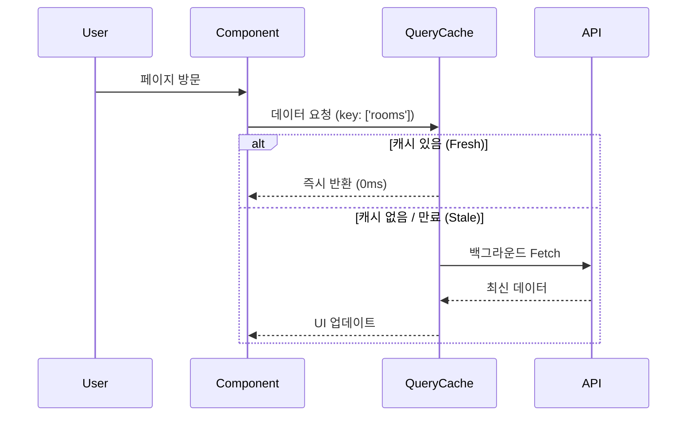

# 시스템 아키텍처 문서 (System Architecture Document)

# Team Pomodoro Timer (Focus Mate)

**문서 버전**: 2.0 (SPA Advanced)
**작성일**: 2025-12-11
**표준 준수**: ISO/IEC 42010:2011

---

## 목차

1. [아키텍처 개요 및 설계 철학](#1-아키텍처-개요-및-설계-철학)
2. [아키텍처 뷰포인트](#2-아키텍처-뷰포인트)
3. [기술 스택 및 선택 근거](#3-기술-스택-및-선택-근거)
4. [데이터 모델](#4-데이터-모델)
5. [보안 아키텍처](#5-보안-아키텍처)
6. [확장성 및 성능](#6-확장성-및-성능)

---

## 1. 아키텍처 개요 및 설계 철학

### 1.1 설계 철학 (Design Philosophy)

Focus Mate는 단순한 웹사이트가 아닌 **고성능 생산성 애플리케이션**을 지향합니다. 이를 달성하기 위해 다음 3가지 핵심 철학을 아키텍처에 반영했습니다.

#### 1. Zero-Latency Interaction (즉각적인 반응성)
사용자의 몰입(Flow)을 방해하지 않기 위해, 모든 UI 상호작용은 100ms 이내에 반응해야 합니다.
*   **전략**: 서버 사이드 렌더링(SSR)을 배제하고, **순수 SPA 아키텍처**를 채택하여 페이지 간 이동 시 브라우저 새로고침을 완전히 제거했습니다.
*   **구현**: TanStack Router의 `Preload` 기능을 통해 사용자가 클릭하기도 전에 다음 코드를 미리 불러옵니다.

#### 2. Client-First State (클라이언트 중심 상태)
화면의 상태(State)를 서버에서 받아온 HTML로 결정하는 것이 아니라, 클라이언트가 주도권을 가집니다.
*   **전략**: 백엔드는 순수한 데이터 API 역할만 수행하며, 화면을 어떻게 그릴지는 브라우저(Client)가 전적으로 결정합니다.
*   **구현**: TanStack Query를 도입하여 서버 데이터를 클라이언트 캐시로 동기화하고, 연결이 끊겨도 앱이 동작하도록(Offline Support) 합니다.

#### 3. Type-Safety Across Boundaries (경계 없는 타입 안정성)
프론트엔드와 백엔드 사이의 통신 오류를 원천 차단합니다.
*   **전략**: "문서"가 아닌 "코드"로 계약(Contract)을 맺습니다.
*   **구현**: FastAPI의 OpenAPI 스키마를 기반으로 프론트엔드 TypeScript 타입을 **자동 생성(Codegen)**하여, 백엔드 변경이 프론트엔드 컴파일 에러로 즉시 감지되도록 합니다.

### 1.2 아키텍처 목표 (ISO 25010)

| 품질 속성 | 목표 | 전략 |
| :--- | :--- | :--- |
| **신뢰성 (Reliability)** | 99.9% 가용성 | 엄격한 타입 시스템, TanStack Router의 100% 타입 안전 라우팅 |
| **사용성 (Usability)** | 0.1초 이내 반응 | SPA 아키텍처, Optimistic Updates (낙관적 업데이트) |
| **유지보수성 (Maintainability)** | 모듈 간 의존성 최소화 | 백엔드(Python)와 프론트엔드(React)의 완벽한 물리적/논리적 분리 |

### 1.3 시스템 컨텍스트

```mermaid
graph TD
    User[사용자] -->|HTTPS / WebSocket| CDN[Frontend (Vite SPA)]
    CDN -->|REST / OpenAPI| API[Backend (FastAPI)]
    CDN -->|WebSocket| Socket[Real-time Service]
    API -->|Async| DB[(SQLite/PostgreSQL)]
```

---

## 2. 아키텍처 뷰포인트

### 2.1 논리적 뷰 (Logical View)

#### 2.1.1 프론트엔드 구조 (Advanced SPA)
기존의 `pages` 디렉토리 방식에서 **File-Based Routing** 방식으로 진화했습니다.

```
src/frontend/src/
├── routes/                 # ⭐ 파일 기반 라우팅 (TanStack Router)
│   ├── __root.tsx         # 최상위 레이아웃 (네비게이션 바 등)
│   ├── index.tsx          # 메인 페이지 (/)
│   ├── login.tsx          # 로그인 페이지
│   ├── rooms/
│   │   ├── $roomId.tsx    # 동적 라우팅 (방 상세)
│   │   └── index.tsx      # 방 목록
│   └── _auth.tsx          # 인증이 필요한 라우트 그룹
│
├── components/             # UI 컴포넌트 (Atomic Design)
│   ├── ui/                # Radix UI 기반 기본 컴포넌트
│   └── features/          # 비즈니스 로직이 포함된 컴포넌트
│
├── hooks/                  # 커스텀 훅
│   └── queries/           # ⭐ TanStack Query 훅 (데이터 페칭)
│       ├── useRooms.ts
│       └── useTimer.ts
│
├── api/
│   └── generated/         # ⭐ OpenAPI Codegen으로 자동 생성된 코드
│       ├── models/
│       └── services/
│
└── main.tsx               # 앱 진입점
```

**고도화 포인트**:
1.  **Routes 디렉토리**: URL 구조가 파일 시스템과 1:1로 매핑되어 직관적입니다.
2.  **Generated API**: 백엔드 API를 수동으로 호출(`fetch`)하지 않고, 자동 생성된 함수(`RoomService.create()`)를 호출합니다.

#### 2.1.2 백엔드 구조 (FastAPI Layered)
*(기존과 동일하되, OpenAPI 스키마 생성에 최적화됨)*

*   **Router Layer**: 요청을 받아 Service로 전달. Pydantic 모델을 통해 엄격하게 입력값을 검증.
*   **Service Layer**: 비즈니스 로직 수행.
*   **Repository Layer**: 데이터베이스 접근 추상화.

### 2.2 프로세스 뷰 (데이터 흐름)

#### 데이터 페칭 및 캐싱 (TanStack Query)


---

## 3. 기술 스택 및 선택 근거

### 3.1 핵심 결정 (ADR 요약)

*   **Frontend**: React + **Vite** + **TanStack Router**
    *   *이유*: Next.js(SSR)보다 앱 같은 사용성(UX)과 완벽한 타입 안전성이 더 중요하기 때문.
*   **Backend**: Python **FastAPI**
    *   *이유*: AI 기능 확장성과 고성능 비동기 처리를 모두 만족하는 유일한 선택지.
*   **Data Sync**: **TanStack Query**
    *   *이유*: `useEffect`로 인한 워터폴(Waterfall) 현상을 제거하고, 서버 데이터 상태 관리를 자동화하기 위함.
*   **Communication**: **OpenAPI (REST) + WebSocket**
    *   *이유*: 상태 조회는 REST로 명확하게, 실시간 알림은 WebSocket으로 효율적으로.

---

## 4. 데이터 모델 & 확장성
(기존 ERD 구조 유지 - UUID 기반의 약한 결합 설계)

*   **확장 전략**: 각 도메인(Room, User, Timer)은 서로 **ID 레퍼런스(UUID)**로만 연결됩니다. 향후 마이크로서비스로 분리하거나, 일부 기능을 별도 서버(Node.js 등)로 떼어내더라도 DB 구조를 근본적으로 바꿀 필요가 없습니다.

---

## 5. 보안 아키텍처

*   **JWT 인증**: 모든 API 요청 헤더에 JWT Access Token을 포함합니다.
*   **자동화된 클라이언트**: OpenAPI Codegen이 생성한 클라이언트가 내부적으로 Axios Interceptor를 사용하여 토큰 주입을 자동 처리합니다. 개발자가 실수로 토큰을 빼먹을 위험이 없습니다.
