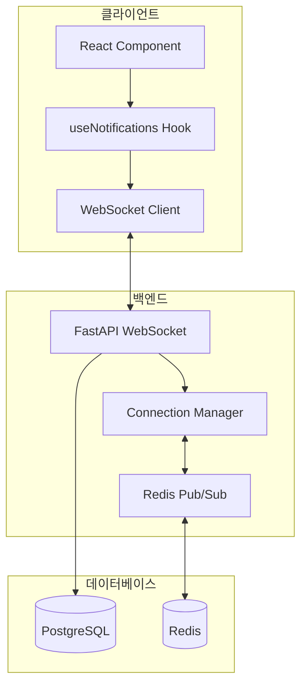
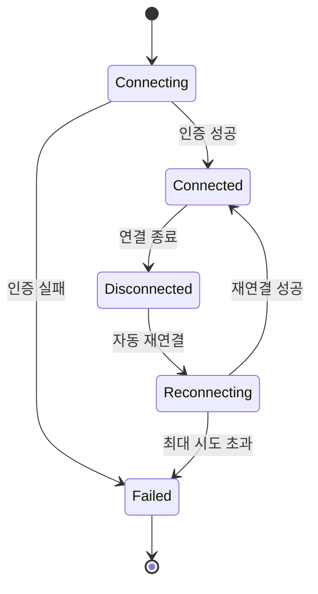
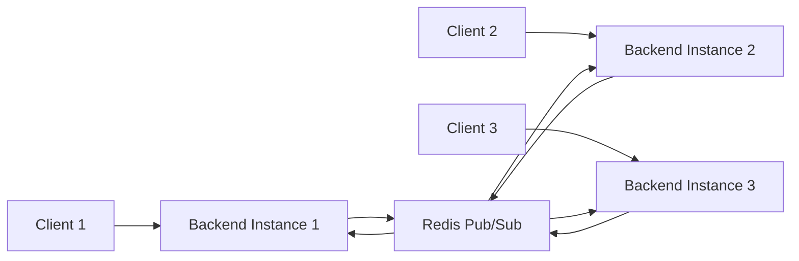

# WebSocket 아키텍처 문서

**문서 버전**: 1.0
**작성일**: 2025-12-18
**프로토콜**: WebSocket (RFC 6455)

---

## 목차

1. [개요](#1-개요)
2. [WebSocket 엔드포인트](#2-websocket-엔드포인트)
3. [메시지 프로토콜](#3-메시지-프로토콜)
4. [연결 관리](#4-연결-관리)
5. [Redis Pub/Sub 통합](#5-redis-pubsub-통합)
6. [프론트엔드 구현](#6-프론트엔드-구현)
7. [백엔드 구현](#7-백엔드-구현)

---

## 1. 개요

### 1.1 WebSocket 사용 이유

**실시간 양방향 통신**이 필요한 기능:
- 실시간 알림 (인증 요청, 팀 초대, 댓글 등)
- 방 타이머 동기화
- 매칭 채팅
- 참여자 상태 업데이트

**HTTP 폴링 대비 장점**:
- 낮은 지연시간 (< 100ms)
- 서버 부하 감소 (연결 유지)
- 양방향 통신 (서버 → 클라이언트 푸시)

### 1.2 아키텍처 다이어그램



---

## 2. WebSocket 엔드포인트

### 2.1 알림 WebSocket

**엔드포인트**: `ws://localhost:8000/api/v1/notifications/ws`

**인증**: JWT 토큰 (쿼리 파라미터)
```
ws://localhost:8000/api/v1/notifications/ws?token=<jwt_token>
```

**용도**:
- 사용자별 실시간 알림
- 시스템 공지사항
- 친구 요청 알림
- 댓글/좋아요 알림

### 2.2 방 WebSocket

**엔드포인트**: `ws://localhost:8000/ws/room/{room_id}`

**용도**:
- 타이머 상태 동기화
- 참여자 입장/퇴장
- 방 설정 변경

### 2.3 매칭 채팅 WebSocket

**엔드포인트**: `ws://localhost:8000/api/v1/matching/chat/{room_id}/ws`

**인증**: JWT 토큰 (쿼리 파라미터)

**용도**:
- 매칭된 사용자 간 실시간 채팅
- 타이핑 인디케이터
- 읽음 확인

---

## 3. 메시지 프로토콜

### 3.1 메시지 형식

#### 클라이언트 → 서버
```typescript
interface ClientMessage {
  type: "ping" | "subscribe" | "unsubscribe";
  data?: any;
}
```

#### 서버 → 클라이언트
```typescript
interface ServerMessage {
  type: "connected" | "notification" | "pong" | "error";
  data?: any;
  message?: string;
  user_id?: string;
}
```

### 3.2 알림 메시지

#### 연결 확인
```json
{
  "type": "connected",
  "message": "Connected to notification service",
  "user_id": "550e8400-e29b-41d4-a716-446655440000"
}
```

#### 알림 수신
```json
{
  "type": "notification",
  "data": {
    "notification_id": "notif-123",
    "type": "friend_request",
    "title": "새 친구 요청",
    "message": "Alice님이 친구 요청을 보냈습니다",
    "data": {
      "routing": {
        "type": "navigate",
        "path": "/friends",
        "params": {}
      }
    },
    "created_at": "2025-12-18T10:00:00Z"
  }
}
```

#### Heartbeat
```json
// 클라이언트 → 서버
{
  "type": "ping"
}

// 서버 → 클라이언트
{
  "type": "pong"
}
```

### 3.3 에러 메시지
```json
{
  "type": "error",
  "message": "Authentication failed",
  "code": "AUTH_ERROR"
}
```

---

## 4. 연결 관리

### 4.1 연결 생명주기



### 4.2 Heartbeat 메커니즘

**목적**: 연결 유지 및 끊김 감지

**구현**:
```typescript
// 30초마다 ping 전송
const pingInterval = setInterval(() => {
  if (ws.readyState === WebSocket.OPEN) {
    ws.send(JSON.stringify({ type: "ping" }));
  }
}, 30000);
```

### 4.3 재연결 전략

**Exponential Backoff**:
```typescript
const reconnect = () => {
  if (reconnectAttempts >= maxReconnectAttempts) {
    console.error("Max reconnect attempts reached");
    return;
  }

  reconnectAttempts++;
  const delay = Math.min(1000 * 2 ** reconnectAttempts, 30000);

  setTimeout(() => connect(), delay);
};
```

**재연결 시도**:
- 1차: 2초 후
- 2차: 4초 후
- 3차: 8초 후
- 4차: 16초 후
- 5차: 30초 후 (최대)

---

## 5. Redis Pub/Sub 통합

### 5.1 다중 인스턴스 지원

**문제**: 여러 백엔드 인스턴스에서 WebSocket 연결 시 메시지 브로드캐스팅 필요

**해결**: Redis Pub/Sub



### 5.2 채널 구조

```python
# 사용자별 알림 채널
CHANNEL_USER_NOTIFICATIONS = "notifications:user:{user_id}"

# 방별 업데이트 채널
CHANNEL_ROOM_UPDATES = "room:{room_id}:updates"

# 매칭 채팅 채널
CHANNEL_MATCHING_CHAT = "matching:chat:{room_id}"
```

### 5.3 메시지 발행/구독

```python
# 메시지 발행
await redis_pubsub_manager.publish(
    channel=f"notifications:user:{user_id}",
    message=notification_data
)

# 메시지 구독
async for message in redis_pubsub_manager.subscribe(channel):
    await websocket.send_json(message)
```

---

## 6. 프론트엔드 구현

### 6.1 useNotifications Hook

**위치**: `frontend/src/hooks/useNotifications.ts`

```typescript
export function useNotifications(
  onNewNotification?: (notification: NotificationData) => void
) {
  const [isConnected, setIsConnected] = useState(false);
  const [notifications, setNotifications] = useState<NotificationData[]>([]);
  const wsRef = useRef<WebSocket | null>(null);

  const connect = useCallback(() => {
    const token = authService.getToken();
    if (!token) return;

    const ws = new WebSocket(
      `${WS_URL}/api/v1/notifications/ws?token=${token}`
    );
    wsRef.current = ws;

    ws.onopen = () => {
      setIsConnected(true);
      // Heartbeat 시작
      pingIntervalRef.current = setInterval(() => {
        if (ws.readyState === WebSocket.OPEN) {
          ws.send(JSON.stringify({ type: "ping" }));
        }
      }, 30000);
    };

    ws.onmessage = (event) => {
      const message: NotificationMessage = JSON.parse(event.data);

      if (message.type === "notification" && message.data) {
        setNotifications((prev) => [message.data!, ...prev]);
        toast.info(message.data.title, {
          description: message.data.message,
        });
        onNewNotification?.(message.data);
      }
    };

    ws.onclose = () => {
      setIsConnected(false);
      // 5초 후 재연결
      setTimeout(() => connect(), 5000);
    };
  }, [onNewNotification]);

  useEffect(() => {
    connect();
    return () => disconnect();
  }, [connect]);

  return { isConnected, notifications, connect, disconnect };
}
```

### 6.2 사용 예시

```typescript
function App() {
  const { isConnected, notifications } = useNotifications((notification) => {
    console.log("New notification:", notification);

    // 라우팅 처리
    if (notification.data?.routing) {
      navigate(notification.data.routing.path);
    }
  });

  return (
    <div>
      <ConnectionStatus connected={isConnected} />
      <NotificationBell notifications={notifications} />
    </div>
  );
}
```

---

## 7. 백엔드 구현

### 7.1 WebSocket 엔드포인트

**위치**: `backend/app/api/v1/endpoints/notifications.py`

```python
@router.websocket("/ws")
async def websocket_endpoint(
    websocket: WebSocket,
    token: str = Query(...),
    db: AsyncSession = Depends(get_db)
):
    # JWT 검증
    try:
        payload = jwt.decode(token, settings.JWT_SECRET_KEY, algorithms=["HS256"])
        user_id = payload.get("sub")
    except JWTError:
        await websocket.close(code=1008, reason="Invalid token")
        return

    # 연결 수락
    await websocket.accept()

    # Connection Manager에 등록
    await connection_manager.connect(user_id, websocket)

    # 연결 확인 메시지
    await websocket.send_json({
        "type": "connected",
        "message": "Connected to notification service",
        "user_id": user_id
    })

    try:
        # Redis 구독 시작
        channel = f"notifications:user:{user_id}"
        async for message in redis_pubsub_manager.subscribe(channel):
            await websocket.send_json(message)
    except WebSocketDisconnect:
        await connection_manager.disconnect(user_id)
```

### 7.2 Connection Manager

```python
class ConnectionManager:
    def __init__(self):
        self.active_connections: Dict[str, WebSocket] = {}

    async def connect(self, user_id: str, websocket: WebSocket):
        self.active_connections[user_id] = websocket

    async def disconnect(self, user_id: str):
        if user_id in self.active_connections:
            del self.active_connections[user_id]

    async def send_personal_message(self, user_id: str, message: dict):
        if user_id in self.active_connections:
            await self.active_connections[user_id].send_json(message)

    async def broadcast(self, message: dict):
        for connection in self.active_connections.values():
            await connection.send_json(message)
```

### 7.3 Redis Pub/Sub Manager

```python
class RedisPubSubManager:
    def __init__(self):
        self.redis_client = None
        self.pubsub = None

    async def connect(self):
        self.redis_client = await aioredis.from_url(
            settings.REDIS_URL,
            encoding="utf-8",
            decode_responses=True
        )
        self.pubsub = self.redis_client.pubsub()

    async def publish(self, channel: str, message: dict):
        await self.redis_client.publish(
            channel,
            json.dumps(message)
        )

    async def subscribe(self, channel: str):
        await self.pubsub.subscribe(channel)
        async for message in self.pubsub.listen():
            if message["type"] == "message":
                yield json.loads(message["data"])
```

---

## 8. 보안 고려사항

### 8.1 인증

- **JWT 토큰**: 쿼리 파라미터로 전달
- **토큰 검증**: 연결 시 필수
- **토큰 만료**: 재연결 시 새 토큰 사용

### 8.2 Rate Limiting

```python
# 연결 제한 (사용자당 최대 5개)
if len(get_user_connections(user_id)) >= 5:
    await websocket.close(code=1008, reason="Too many connections")
```

### 8.3 메시지 검증

```python
# 메시지 크기 제한
MAX_MESSAGE_SIZE = 1024 * 10  # 10KB

if len(message) > MAX_MESSAGE_SIZE:
    await websocket.close(code=1009, reason="Message too large")
```

---

## 9. 모니터링

### 9.1 메트릭

- **활성 연결 수**: `connection_manager.count()`
- **메시지 처리량**: 초당 메시지 수
- **평균 지연시간**: 메시지 발송 → 수신

### 9.2 로깅

```python
logger.info(f"WebSocket connected: user_id={user_id}")
logger.info(f"Message sent: user_id={user_id}, type={message_type}")
logger.error(f"WebSocket error: user_id={user_id}, error={error}")
```

---

## 10. 참고 문서

- [TECH-001: 기술 스택](file:///Users/juns/FocusMate/docs/00_overview/TECH-001_기술_스택.md)
- [ARC-001: 시스템 아키텍처](file:///Users/juns/FocusMate/docs/02_architecture/ARC-001_System_Architecture.md)
- [DEV-007: WebSocket 구현](file:///Users/juns/FocusMate/docs/04_development/DEV-007_WebSocket_Implementation.md)

---

**문서 끝**
