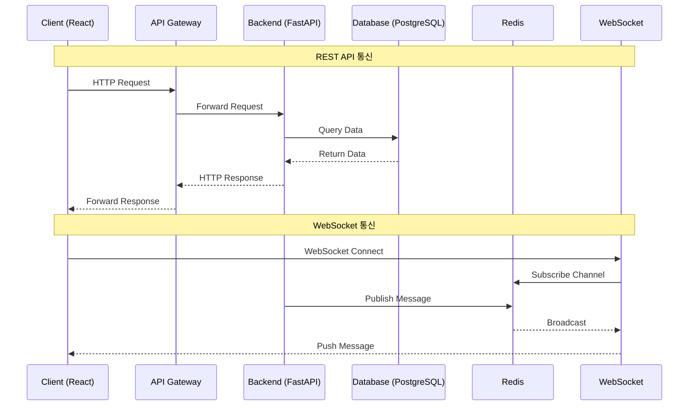
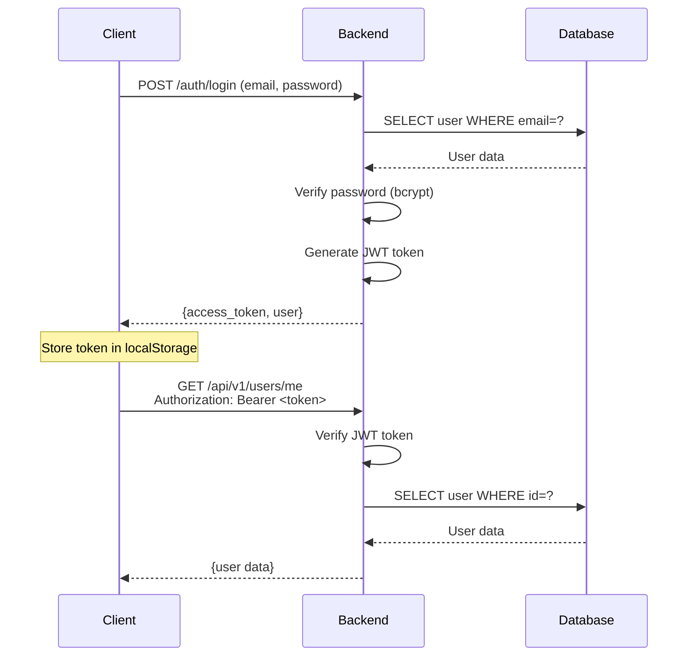
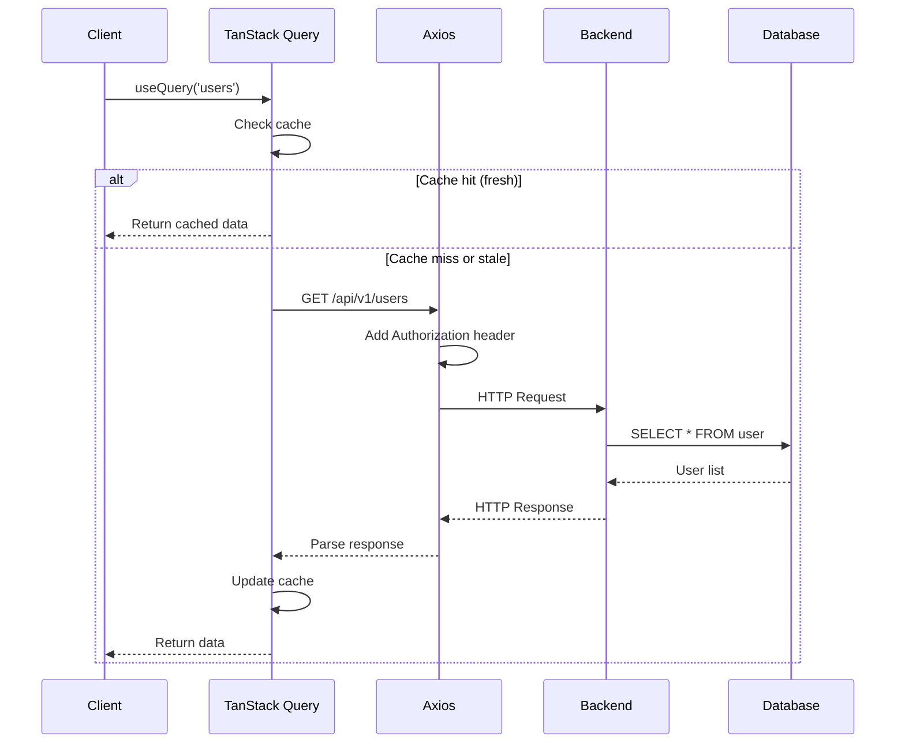
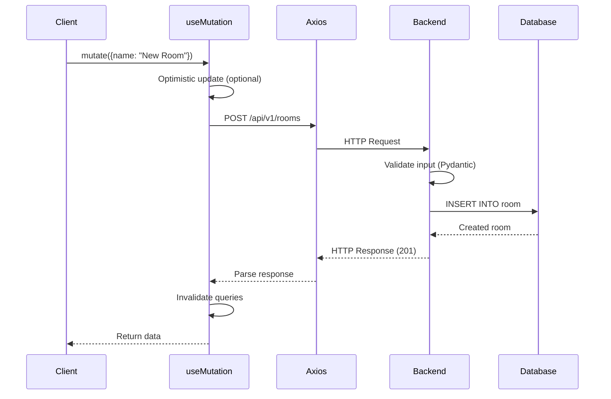

# 네트워크 통신 아키텍처 문서

**문서 버전**: 1.0
**작성일**: 2025-12-18

---

## 목차

1. [개요](#1-개요)
2. [REST API 통신](#2-rest-api-통신)
3. [WebSocket 통신](#3-websocket-통신)
4. [HTTP/HTTPS 설정](#4-httphttps-설정)
5. [CORS 정책](#5-cors-정책)
6. [요청/응답 흐름](#6-요청응답-흐름)
7. [에러 처리](#7-에러-처리)

---

## 1. 개요

### 1.1 통신 프로토콜

Focus Mate는 두 가지 통신 프로토콜을 사용합니다:

1. **REST API** (HTTP/HTTPS)
   - 상태 조회 (GET)
   - 데이터 생성/수정/삭제 (POST/PUT/DELETE)
   - 파일 업로드/다운로드

2. **WebSocket**
   - 실시간 알림
   - 양방향 메시징
   - 상태 동기화

### 1.2 통신 흐름 다이어그램



---

## 2. REST API 통신

### 2.1 Base URL

**개발 환경**:
```
http://localhost:8000/api/v1
```

**프로덕션 환경**:
```
https://api.focusmate.com/api/v1
```

### 2.2 요청 형식

#### 헤더
```http
Content-Type: application/json
Authorization: Bearer <jwt_token>
Accept: application/json
```

#### 요청 본문 (JSON)
```json
{
  "field1": "value1",
  "field2": "value2"
}
```

### 2.3 응답 형식

#### 성공 응답 (200/201)
```json
{
  "status": "success",
  "data": {
    "id": "550e8400-e29b-41d4-a716-446655440000",
    "name": "Example"
  },
  "message": "Operation completed successfully"
}
```

#### 에러 응답 (4xx/5xx)
```json
{
  "status": "error",
  "error": {
    "code": "VALIDATION_ERROR",
    "message": "Invalid input data",
    "details": [
      {
        "field": "email",
        "message": "Invalid email format"
      }
    ]
  }
}
```

### 2.4 HTTP 메서드

| 메서드 | 용도 | 예시 |
|--------|------|------|
| GET | 리소스 조회 | `GET /api/v1/users/{id}` |
| POST | 리소스 생성 | `POST /api/v1/users` |
| PUT | 리소스 전체 수정 | `PUT /api/v1/users/{id}` |
| PATCH | 리소스 부분 수정 | `PATCH /api/v1/users/{id}` |
| DELETE | 리소스 삭제 | `DELETE /api/v1/users/{id}` |

---

## 3. WebSocket 통신

### 3.1 연결 URL

```
ws://localhost:8000/api/v1/notifications/ws?token=<jwt_token>
```

### 3.2 메시지 형식

#### 클라이언트 → 서버
```json
{
  "type": "ping",
  "data": {}
}
```

#### 서버 → 클라이언트
```json
{
  "type": "notification",
  "data": {
    "notification_id": "notif-123",
    "title": "새 알림",
    "message": "알림 내용"
  }
}
```

### 3.3 연결 상태

| 상태 | 코드 | 설명 |
|------|------|------|
| CONNECTING | 0 | 연결 중 |
| OPEN | 1 | 연결됨 |
| CLOSING | 2 | 종료 중 |
| CLOSED | 3 | 종료됨 |

---

## 4. HTTP/HTTPS 설정

### 4.1 개발 환경

```yaml
Protocol: HTTP
Port: 8000
Host: localhost
```

### 4.2 프로덕션 환경

```yaml
Protocol: HTTPS
Port: 443
Host: api.focusmate.com
SSL/TLS: Let's Encrypt
```

### 4.3 보안 헤더

```http
Strict-Transport-Security: max-age=31536000; includeSubDomains
X-Content-Type-Options: nosniff
X-Frame-Options: DENY
X-XSS-Protection: 1; mode=block
Content-Security-Policy: default-src 'self'
```

---

## 5. CORS 정책

### 5.1 설정

**백엔드 설정** (`backend/app/main.py`):
```python
app.add_middleware(
    CORSMiddleware,
    allow_origins=["http://localhost:3000", "https://focusmate.com"],
    allow_credentials=True,
    allow_methods=["GET", "POST", "PUT", "PATCH", "DELETE", "OPTIONS"],
    allow_headers=["*"],
    expose_headers=["*"],
    max_age=3600,  # 1시간 캐싱
)
```

### 5.2 Preflight 요청

**OPTIONS 요청**:
```http
OPTIONS /api/v1/users HTTP/1.1
Origin: http://localhost:3000
Access-Control-Request-Method: POST
Access-Control-Request-Headers: Content-Type, Authorization
```

**응답**:
```http
HTTP/1.1 200 OK
Access-Control-Allow-Origin: http://localhost:3000
Access-Control-Allow-Methods: GET, POST, PUT, PATCH, DELETE, OPTIONS
Access-Control-Allow-Headers: Content-Type, Authorization
Access-Control-Max-Age: 3600
```

### 5.3 CORS 에러 해결

**문제**: `No 'Access-Control-Allow-Origin' header`

**해결**:
1. `allow_origins`에 프론트엔드 URL 추가
2. `allow_methods`에 `OPTIONS` 명시적 추가
3. `max_age` 설정으로 Preflight 캐싱

---

## 6. 요청/응답 흐름

### 6.1 인증 흐름



### 6.2 데이터 조회 흐름



### 6.3 데이터 생성 흐름



---

## 7. 에러 처리

### 7.1 HTTP 상태 코드

| 코드 | 의미 | 처리 방법 |
|------|------|-----------|
| 200 | OK | 정상 처리 |
| 201 | Created | 리소스 생성 성공 |
| 400 | Bad Request | 요청 형식 오류 → 사용자에게 알림 |
| 401 | Unauthorized | 인증 실패 → 로그인 페이지로 이동 |
| 403 | Forbidden | 권한 없음 → 에러 메시지 표시 |
| 404 | Not Found | 리소스 없음 → 404 페이지 표시 |
| 422 | Unprocessable Entity | 유효성 검증 실패 → 필드별 에러 표시 |
| 500 | Internal Server Error | 서버 오류 → 재시도 또는 관리자 문의 |

### 7.2 프론트엔드 에러 처리

```typescript
// Axios Interceptor
axios.interceptors.response.use(
  (response) => response,
  (error) => {
    if (error.response?.status === 401) {
      // 토큰 만료 → 로그아웃
      authService.logout();
      navigate("/login");
    } else if (error.response?.status === 500) {
      // 서버 에러 → Toast 알림
      toast.error("서버 오류가 발생했습니다");
    }
    return Promise.reject(error);
  }
);
```

### 7.3 백엔드 에러 처리

```python
@app.exception_handler(AppException)
async def app_exception_handler(request, exc: AppException):
    return JSONResponse(
        status_code=400,
        content={
            "status": "error",
            "error": {
                "code": exc.code,
                "message": exc.message,
                "details": exc.details,
            }
        }
    )

@app.exception_handler(ValidationError)
async def validation_exception_handler(request, exc: ValidationError):
    return JSONResponse(
        status_code=422,
        content={
            "status": "error",
            "error": {
                "code": "VALIDATION_ERROR",
                "message": "Invalid input data",
                "details": exc.errors()
            }
        }
    )
```

---

## 8. 성능 최적화

### 8.1 캐싱 전략

**TanStack Query (프론트엔드)**:
```typescript
useQuery({
  queryKey: ['users'],
  queryFn: fetchUsers,
  staleTime: 5 * 60 * 1000,  // 5분
  cacheTime: 10 * 60 * 1000, // 10분
});
```

**Redis (백엔드)**:
```python
# 리더보드 캐싱 (1분)
cached_leaderboard = await redis.get("leaderboard")
if cached_leaderboard:
    return json.loads(cached_leaderboard)

leaderboard = await get_leaderboard_from_db()
await redis.setex("leaderboard", 60, json.dumps(leaderboard))
```

### 8.2 압축

**Gzip 압축**:
```python
from fastapi.middleware.gzip import GZipMiddleware

app.add_middleware(GZipMiddleware, minimum_size=1000)
```

### 8.3 연결 풀링

**SQLAlchemy**:
```python
engine = create_async_engine(
    DATABASE_URL,
    pool_size=20,
    max_overflow=10,
)
```

---

## 9. 모니터링

### 9.1 로깅

```python
import logging

logger = logging.getLogger(__name__)

# 요청 로깅
logger.info(f"Request: {method} {path} - User: {user_id}")

# 응답 로깅
logger.info(f"Response: {status_code} - Duration: {duration}ms")

# 에러 로깅
logger.error(f"Error: {error_message}", exc_info=True)
```

### 9.2 메트릭

- **요청 수**: 초당 요청 수 (RPS)
- **응답 시간**: 평균/P95/P99
- **에러율**: 4xx/5xx 비율
- **WebSocket 연결 수**: 활성 연결 수

---

## 10. 참고 문서

- [TECH-001: 기술 스택](file:///Users/juns/FocusMate/docs/00_overview/TECH-001_기술_스택.md)
- [ARC-001: 시스템 아키텍처](file:///Users/juns/FocusMate/docs/02_architecture/ARC-001_System_Architecture.md)
- [ARC-013: WebSocket 아키텍처](file:///Users/juns/FocusMate/docs/02_architecture/ARC-013_WebSocket_아키텍처.md)
- [REQ-002: API 명세](file:///Users/juns/FocusMate/docs/01_requirements/REQ-002_API_Specification.md)

---

**문서 끝**
