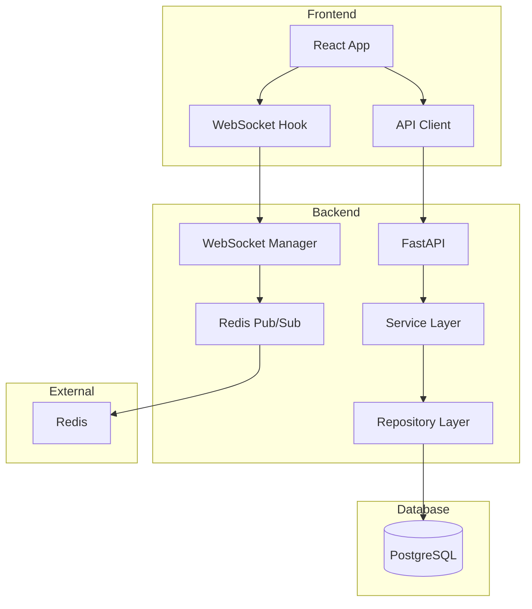
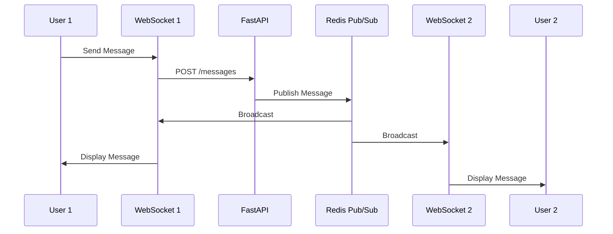

# 통합 메시징 시스템 아키텍처

## 시스템 개요

FocusMate의 통합 메시징 시스템은 3가지 타입의 채팅을 지원하는 실시간 통신 플랫폼입니다.

### 지원 채팅 타입

1. **Direct (1:1)**: 개인 간 직접 메시지
2. **Team**: 팀 채널 (공개/비공개)
3. **Matching**: 매칭 그룹 채팅 (블라인드 모드 지원)

### 핵심 기능

- ✅ 실시간 메시징 (WebSocket)
- ✅ 메시지 CRUD (생성, 읽기, 수정, 삭제)
- ✅ 파일 업로드 (이미지/파일, 10-50MB)
- ✅ 메시지 리액션 (이모지)
- ✅ 메시지 검색
- ✅ 읽음 표시 및 미읽음 카운트
- ✅ 스레드 및 답장
- ✅ 블라인드 모드 (익명 채팅)

## 시스템 아키텍처



## 메시지 플로우



## 데이터베이스 스키마

### chat_rooms

채팅방 정보를 저장하는 메인 테이블입니다.

```sql
CREATE TABLE chat_rooms (
    room_id UUID PRIMARY KEY DEFAULT gen_random_uuid(),
    room_type VARCHAR(20) NOT NULL,  -- 'direct', 'team', 'matching'
    room_name VARCHAR(255),
    description TEXT,
    room_metadata JSON,  -- Type-specific data
    display_mode VARCHAR(10),  -- 'open', 'blind'
    is_active BOOLEAN DEFAULT true,
    is_archived BOOLEAN DEFAULT false,
    created_at TIMESTAMP WITH TIME ZONE DEFAULT NOW(),
    updated_at TIMESTAMP WITH TIME ZONE DEFAULT NOW(),
    last_message_at TIMESTAMP WITH TIME ZONE
);
```

**주요 필드**:
- `room_type`: 채팅방 타입 구분
- `room_metadata`: 타입별 추가 데이터 (JSON)
- `display_mode`: 블라인드 모드 여부

### chat_members

채팅방 멤버십 정보를 관리합니다.

```sql
CREATE TABLE chat_members (
    member_id UUID PRIMARY KEY DEFAULT gen_random_uuid(),
    room_id UUID REFERENCES chat_rooms(room_id),
    user_id VARCHAR(255) NOT NULL,
    role VARCHAR(20) DEFAULT 'member',
    anonymous_name VARCHAR(50),  -- For blind mode
    group_label VARCHAR(10),     -- For matching (A/B)
    is_active BOOLEAN DEFAULT true,
    is_muted BOOLEAN DEFAULT false,
    last_read_at TIMESTAMP WITH TIME ZONE,
    unread_count INTEGER DEFAULT 0,
    joined_at TIMESTAMP WITH TIME ZONE DEFAULT NOW(),
    left_at TIMESTAMP WITH TIME ZONE,
    UNIQUE(room_id, user_id)
);
```

**주요 필드**:
- `anonymous_name`: 블라인드 모드용 익명 이름
- `group_label`: 매칭 채팅용 그룹 구분 (A/B)
- `unread_count`: 미읽은 메시지 수

### chat_messages

메시지 내용과 메타데이터를 저장합니다.

```sql
CREATE TABLE chat_messages (
    message_id UUID PRIMARY KEY DEFAULT gen_random_uuid(),
    room_id UUID REFERENCES chat_rooms(room_id),
    sender_id VARCHAR(255) NOT NULL,
    content TEXT NOT NULL,
    message_type VARCHAR(20) DEFAULT 'text',
    attachments JSON,
    reactions JSON,
    thread_id UUID,
    reply_to_id UUID,
    is_edited BOOLEAN DEFAULT false,
    is_deleted BOOLEAN DEFAULT false,
    created_at TIMESTAMP WITH TIME ZONE DEFAULT NOW(),
    updated_at TIMESTAMP WITH TIME ZONE DEFAULT NOW(),
    deleted_at TIMESTAMP WITH TIME ZONE
);
```

**주요 필드**:
- `message_type`: text, image, file, system
- `attachments`: 첨부파일 정보 (JSON)
- `reactions`: 리액션 정보 (JSON)
- `thread_id`: 스레드 ID
- `is_deleted`: 소프트 삭제 플래그

## 기술 스택

### Backend
- **Framework**: FastAPI
- **Database**: PostgreSQL
- **Cache/Pub-Sub**: Redis
- **WebSocket**: FastAPI WebSocket
- **ORM**: SQLAlchemy (Async)

### Frontend
- **Framework**: React + TypeScript
- **State**: TanStack Query
- **WebSocket**: Native WebSocket API
- **Styling**: Tailwind CSS

## 실시간 통신

### WebSocket 연결

```typescript
// Frontend
const ws = new WebSocket(`${WS_URL}/api/v1/chats/ws?token=${token}`);

ws.onmessage = (event) => {
  const data = JSON.parse(event.data);
  // Handle message, message_updated, message_deleted, typing
};
```

### Redis Pub/Sub

```python
# Backend
await redis_pubsub_manager.publish_event(
    room_id,
    "message",
    {"message": message_data}
)
```

## 보안

### 인증
- JWT 토큰 기반 인증
- WebSocket 연결 시 토큰 검증

### 권한
- 채팅방 멤버만 메시지 조회/전송 가능
- 본인 메시지만 수정/삭제 가능
- 관리자 권한 별도 관리

### 데이터 보호
- 소프트 삭제로 데이터 복구 가능
- 블라인드 모드에서 실명 숨김
- 파일 업로드 검증 (타입, 크기)

## 성능 최적화

### 데이터베이스
- 인덱스: `room_id`, `sender_id`, `created_at`
- 페이지네이션: 메시지 목록 조회
- 연결 풀링: AsyncPG

### 캐싱
- Redis: 활성 사용자, 온라인 상태
- 메모리: WebSocket 연결 관리

### 실시간
- Redis Pub/Sub: 서버 간 메시지 동기화
- WebSocket: 클라이언트 실시간 업데이트

---

**작성일**: 2025-12-12
**버전**: 1.0.0
