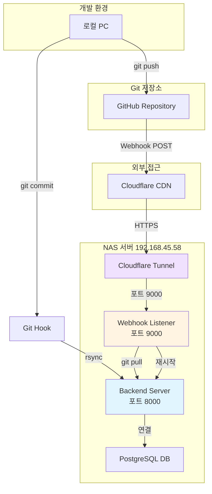
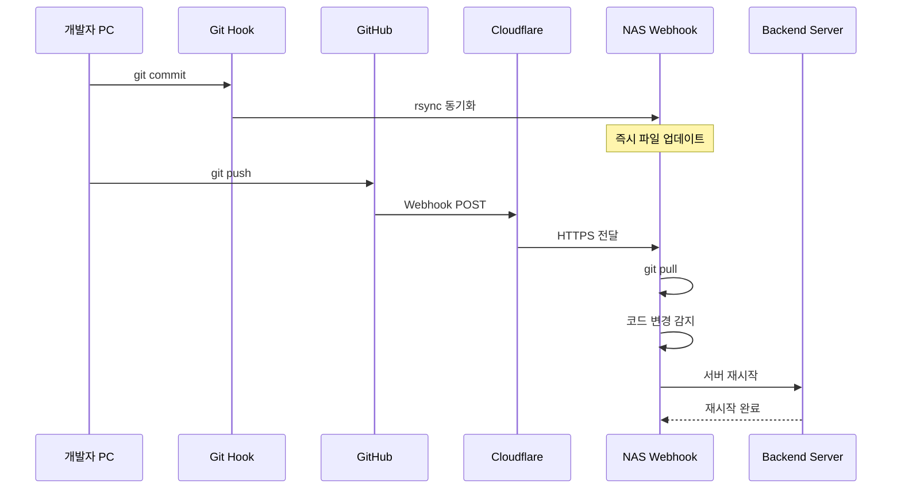

# DEPLOY-014: 자동 배포 시스템 완성 가이드

GitHub Webhook과 Git Hook을 활용한 완전 자동화된 배포 파이프라인 구축 및 검증 완료 문서입니다.

## 배포 아키텍처

### 전체 시스템 구조



### 배포 파이프라인



## 구현된 배포 방법

### 방법 1: Git Hook + rsync (개발용)

**트리거:** `git commit`

**동작 흐름:**

1. 로컬에서 코드 수정
2. `git add .` + `git commit`
3. post-commit hook 자동 실행
4. rsync로 NAS에 즉시 동기화

**장점:**

- ⚡ 즉시 동기화 (1-2초)
- 🚀 빠른 개발 사이클
- 🔄 GitHub 없이 테스트 가능

**단점:**

- ⚠️ 로컬 네트워크 필요
- ⚠️ GitHub와 불일치 가능

**구현 파일:**

- `.git/hooks/post-commit` - Git Hook 스크립트
- `scripts/setup-nas-initial.sh` - 초기 설정
- `scripts/test-nas-sync.sh` - 동기화 테스트

### 방법 2: GitHub Webhook (운영용)

**트리거:** `git push`

**동작 흐름:**

1. 로컬에서 코드 수정
2. `git add .` + `git commit` + `git push`
3. GitHub에서 Webhook 전송
4. Cloudflare Tunnel을 통해 NAS 전달
5. NAS에서 `git pull` 실행
6. 코드 변경 감지 시 서버 자동 재시작

**장점:**

- ✅ GitHub 기반 (단일 진실 공급원)
- 🌐 어디서든 배포 가능
- 🔄 자동 재시작
- 🔒 보안 (Secret 검증)

**단점:**

- 🐢 약간 느림 (5-10초)
- 🔧 초기 설정 필요

**구현 파일:**

- `backend/scripts/deployment/github-webhook-listener.py` - Webhook 서버
- `backend/scripts/deployment/start-webhook-listener.sh` - 시작 스크립트
- `backend/start-nas.sh` - 통합 시작 (자동 실행)

## 설정 완료 확인

### 1. Cloudflare Tunnel 설정

**Public Hostnames:**

- `api.eieconcierge.com` → `http://localhost:8000` (백엔드)
- `webhook.eieconcierge.com` → `http://localhost:9000` (Webhook)

**확인 방법:**

```bash
# NAS에서
curl http://localhost:9000
# 출력: GitHub Webhook Listener is running
```

### 2. NAS 서비스 실행

**실행 중인 서비스:**

```bash
# NAS에서 확인
ps aux | grep -E "uvicorn|webhook-listener|cloudflared"
```

**예상 출력:**

```
juns  10757  python3 -m uvicorn app.main:app --host 0.0.0.0 --port 8000
juns  10768  python3 .../github-webhook-listener.py
juns  10773  cloudflared tunnel run --token ...
```

### 3. GitHub Webhook 설정

**설정 정보:**

- **Payload URL:** `https://webhook.eieconcierge.com`
- **Content type:** `application/json`
- **Secret:** `86c372db51eaa4d17e2140df67aeba30db2775839d6e99ea19761b17e2e1875c`
- **Events:** Just the push event
- **Status:** ✅ Last delivery was successful

### 4. 환경 변수 설정

**NAS `.env` 파일:**

```bash
# GitHub Webhook Secret
GITHUB_WEBHOOK_SECRET=86c372db51eaa4d17e2140df67aeba30db2775839d6e99ea19761b17e2e1875c
```

## 사용 방법

### 개발 워크플로우 (Git Hook)

```bash
# 1. 코드 수정
vim backend/app/main.py

# 2. 커밋 (자동 동기화)
git add .
git commit -m "feat: add new feature"
# → rsync 자동 실행
# → NAS에 즉시 동기화됨

# 3. NAS에서 테스트
ssh juns@192.168.45.58
cd /volume1/web/focusmate-backend
bash stop-nas.sh && bash start-nas.sh

# 4. 테스트 통과 후 GitHub에 push
git push origin main
```

### 배포 워크플로우 (GitHub Webhook)

```bash
# 1. 코드 수정 및 커밋
git add .
git commit -m "feat: add new feature"

# 2. GitHub에 push (자동 배포 트리거)
git push origin main
# → GitHub Webhook 전송
# → NAS에서 git pull
# → 코드 변경 감지
# → 서버 자동 재시작

# 3. 로그 확인 (선택적)
ssh juns@192.168.45.58
tail -f /volume1/web/focusmate-backend/logs/webhook-listener.log
```

**예상 로그:**

```
[Webhook] 📥 Event: push
[Webhook] 🔄 Processing push to refs/heads/main
[Webhook] 📂 Project directory: /volume1/web/focusmate-backend
[Webhook] ✅ Git pull successful
[Webhook] Output: Updating e975c9b..3d0333b
[Webhook] 🔄 Code changes detected, updating server...
[Webhook] ✅ Migrations completed
[Webhook] ✅ Server stopped
[Webhook] ✅ Server started
```

### 긴급 배포 (수동)

```bash
# NAS SSH 접속
ssh juns@192.168.45.58

# 수동 배포
cd /volume1/web/focusmate-backend
git pull origin main
bash stop-nas.sh && bash start-nas.sh
```

## 검증 결과

### 테스트 시나리오

#### 1. Git Hook 동기화 테스트

**실행:**

```bash
git commit --allow-empty -m "test: webhook test"
```

**결과:**

```
✅ Synced to NAS: 192.168.45.58:/volume1/web/focusmate-backend
```

**검증:** rsync를 통해 NAS에 즉시 동기화됨

#### 2. GitHub Webhook 테스트

**실행:**

```bash
git push origin main
```

**GitHub 응답:**

```
✅ Last delivery was successful
```

**NAS 로그:**

```
[Webhook] 📥 Event: push
[Webhook] ✅ Git pull successful
```

**검증:** GitHub → Cloudflare → NAS 전체 파이프라인 정상 작동

#### 3. 서비스 상태 확인

**Backend Server (포트 8000):**

```bash
curl http://localhost:8000/health
# 출력: {"status":"healthy"}
```

**Webhook Listener (포트 9000):**

```bash
curl http://localhost:9000
# 출력: GitHub Webhook Listener is running
```

**Cloudflare Tunnel:**

```bash
curl https://api.eieconcierge.com/health
# 출력: {"status":"healthy"}
```

## 문제 해결

### Webhook 연결 실패 (failed to connect to host)

**증상:**

- GitHub에서 "failed to connect to host" 오류

**원인:**

1. Webhook Listener가 실행되지 않음
2. Cloudflare Tunnel이 연결되지 않음

**해결:**

```bash
# NAS에서 서비스 확인
ps aux | grep webhook-listener

# 실행되지 않았다면
cd /volume1/web/focusmate-backend
bash start-nas.sh

# Cloudflare Tunnel 로그 확인
tail -f /volume1/web/cloudflare-tunnel/tunnel.log
```

### rsync 동기화 실패

**증상:**

- `git commit` 후 "Permission denied" 또는 "Connection refused"

**원인:**

1. SSH 키 인증 문제
2. NAS가 같은 네트워크에 없음

**해결:**

```bash
# SSH 연결 테스트
ssh juns@192.168.45.58 "echo 'SSH OK'"

# SSH 키 복사 (필요시)
ssh-copy-id juns@192.168.45.58

# 수동 rsync 테스트
rsync -avz backend/ juns@192.168.45.58:/volume1/web/focusmate-backend/
```

### 서버 자동 재시작 안 됨

**증상:**

- Webhook은 성공하지만 서버가 재시작되지 않음

**원인:**

- 코드 변경이 감지되지 않음 ("Already up to date")

**확인:**

```bash
# NAS 로그 확인
tail -f /volume1/web/focusmate-backend/logs/webhook-listener.log

# "Already up to date" 메시지 확인
# → 정상 동작 (변경사항 없으면 재시작 안 함)
```

## 배포 체크리스트

### 초기 설정 (한 번만)

- [x] Cloudflare Tunnel Public Hostname 설정
  - [x] `api.eieconcierge.com` → `http://localhost:8000`
  - [x] `webhook.eieconcierge.com` → `http://localhost:9000`
- [x] NAS `.env` 파일에 `GITHUB_WEBHOOK_SECRET` 추가
- [x] GitHub Webhook 설정
  - [x] Payload URL: `https://webhook.eieconcierge.com`
  - [x] Secret 설정
  - [x] Events: Just the push event
- [x] Git Hook 설정 (`.git/hooks/post-commit`)

### 일상 배포

- [ ] 코드 수정
- [ ] `git add .` + `git commit`
- [ ] (선택) NAS에서 즉시 테스트
- [ ] `git push origin main`
- [ ] GitHub Webhook 성공 확인
- [ ] (선택) NAS 로그 확인

## 참고 문서

- [DEPLOY-011_NAS_Deployment.md](./DEPLOY-011_NAS_Deployment.md) - NAS 배포 기본 가이드
- [DEPLOY-013_GitHub_Webhook_Setup.md](./DEPLOY-013_GitHub_Webhook_Setup.md) - Webhook 상세 설정
- [DEPLOY-007_Cloudflare_Tunnel_Setup.md](./DEPLOY-007_Cloudflare_Tunnel_Setup.md) - Cloudflare Tunnel 설정

## 요약

### 현재 상태

✅ **완전 자동화된 배포 파이프라인 구축 완료**

**구현된 기능:**

- ✅ Git Hook을 통한 즉시 동기화 (개발용)
- ✅ GitHub Webhook을 통한 자동 배포 (운영용)
- ✅ 코드 변경 감지 및 자동 재시작
- ✅ Cloudflare Tunnel을 통한 외부 접근
- ✅ Secret 기반 보안 검증

**배포 방법:**

```bash
# 개발: 빠른 테스트
git commit -m "fix: bug fix"
# → NAS에 즉시 동기화

# 배포: 안전한 배포
git push origin main
# → GitHub → NAS 자동 배포
```

**다음 단계:**

- 실운영 배포 전 `github-webhook-listener.py`의 `self.restart_server()` 주석 처리 권장
- 무중단 배포 또는 Blue-Green 배포 고려
